class: middle

# Programme de la journée

## Matin
1.	Quelques rappels sur les données de la recherche
2.	Le PGD en théorie : définition et modèles  
3.  Des évolutions à prévoir : MaDMP et data papers	

## Après-midi
4.	Le PGD en pratique : un retour d’expérience de rédaction
5.  Le PGD en pratique : guide de rédaction et étude de plans rédigés
6.	Boîte à outils : prise en main de DMP OPIDoR

[Support et matériel](https://github.com/carenes/urfist_bdx_DMP) à télécharger

---

class: middle

# Qui suis-je ?

* Cécile Arènes  <a href="https://orcid.org/0000-0002-1839-3530"></a>
* Conservatrice des bibliothèques
* Chargée de mission Données de la recherche et Humanités numériques à la bibliothèque de Sorbonne Université
* Membre du GTSO données de Couperin et du collège Données du CoSO

---

class: center, inverse, middle

# Tour de table

---

class: middle

# Vos attentes

* Votre nom
* Votre fonction 
* Un souhait pour cette formation

---

class: center, middle
background-color: #bebebe

# En guise d'introduction 

## Êtes-vous [FAIR-aware](https://doranum.fr/enjeux-benefices/outil-fair-aware/) ?


---

class: center, inverse, middle

# 1. Quelques rappels sur les données de la recherche

---

class: middle

# La science ouverte, une définition

> “Open Science is the practice of science in such a way that others can collaborate and contribute, where research data, lab notes and other research processes are freely available, under terms that enable reuse, redistribution and reproduction of the research and its underlying data and methods.”

FOSTER. s. d. « Open Science Definition ». Consulté le 3 octobre 2021. https://www.fosteropenscience.eu/foster-taxonomy/open-science-definition.

---


# Le mouvement de l'open data : des initiatives anciennes

* 1992 : [Genbank](https://www.ncbi.nlm.nih.gov/genbank/)
* 2007 : travaux sur l’[Open government data à l’initiative](https://opengovdata.org/) de Lawrence  Lessig,  Tim  O’Reilly,  Ethan  Zuckermann,  Joseph  Hall,  Aaron  Schwartz et Carl Mamamud

.center[
```{r echo=FALSE, out.height=182, out.width=1020}
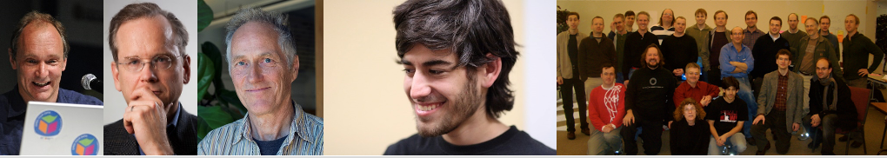
```
]

**Principes : accessibilité, données non-propriétaires, licences ouvertes, etc.**  

&nbsp;	

<small>Images : Silvio Tanaka, « Tim Berners-Lee, CC BY 2.0. https://commons.wikimedia.org/wiki/File:Tim_Berners-Lee_CP.jpg </small>
<small>Lessig 2016, CC BY 2.0, https://commons.wikimedia.org/wiki/File:Lawrence_Lessig_Headshot.jpg</small> 
<small>Christopher Michel, “Tim O’Reilly”, CC BY 2.0, https://commons.wikimedia.org/wiki/File:Tim_O%27Reilly_-_2017_(38700700672)_(cropped).jpg</small> 
<small>Sage Ross, CC BY-SA 2.0, https://commons.wikimedia.org/wiki/File:Aaron_Swartz_2_at_Boston_Wikipedia_Meetup,_2009-08-18.jpg</small> 
<small>David Orban, CC:BY, Open Government Working Group, https://www.flickr.com/photos/davidorban/2095565103/in/album-72157603410393877/</small>


---

# Le mouvement de l'open data : du côté du web

[Echelle 5 étoiles](https://5stardata.info/fr/), Tim Berners-Lee, 2006

- ★ publiez vos données sur le Web (peu importe leur format) avec une licence ouverte
- ★★ publiez-les en tant que données structurées (par exemple, un document Excel au lieu d’une image scannée d’un tableau)
- ★★★ publiez-les dans un format ouvert et non-propriétaire (par exemple, 
un CSV plutôt qu’un Excel)
- ★★★★ utilisez des URI pour désigner des choses dans vos données, 
afin que les gens puissent faire des références à celles-ci
- ★★★★★ liez vos données à d’autres données 
pour y ajouter du contexte


.center[
```{r echo=FALSE, out.height=150, out.width=350}
knitr::include_graphics("img/echelle5etoiles.png")
```
]


---

# Ouvrir les données, un enjeu économique 

.pull-left[
```{r echo=FALSE, out.height=400, out.width=300}
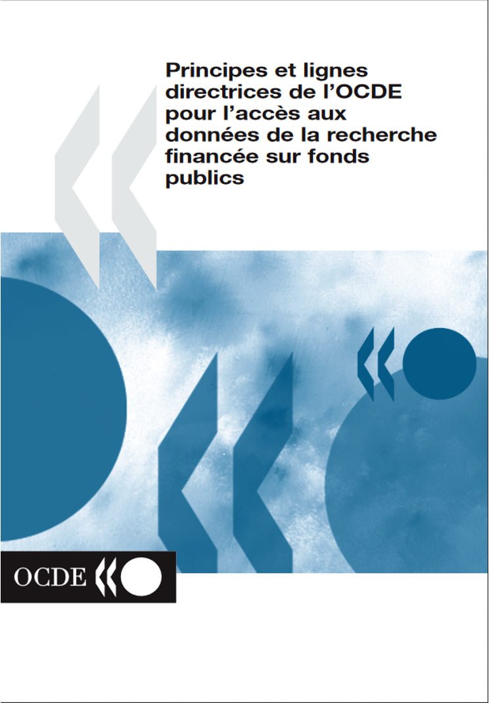
```
]

.pull-right[
2007 : Parution du rapport de l’OCDE, « Principes et lignes directrices de l’OCDE pour l’accès aux données de la recherche financée sur fonds publics ». http://www.oecd.org/fr/science/inno/38500823.pdf 
]


---

# Le mouvement de l'open data : répondre à une attente citoyenne

* [Open government partnership](https://www.opengovpartnership.org/), 2011, 78 pays
* « OGP’s vision is that more governments become sustainably more transparent, more accountable, and more responsive to their own citizens, with the ultimate goal of improving the quality of governance, as well as the quality of services that citizens receive. »

.center[]


---

# Le mouvement de l'open data : en France

* Ouverture de [data.gouv.fr](https://www.data.gouv.fr/fr/) en 2011
* Création de la mission interministérielle [Etalab](https://www.etalab.gouv.fr/qui-sommes-nous) en 2013 
* Pour une action publique transparente et collaborative : plan d’action national pour la France, 2015-2017, puis 2018-2020
  * 21 engagements : engagement 18 : « Construire un écosystème de la science ouverte »
* **Partenariat pour un gouvernement ouvert** [2021-2023](https://www.modernisation.gouv.fr/transformer-laction-publique/partenariat-pour-un-gouvernement-ouvert)

.center[]

---

# La feuille de route du MESRI pour les données et les codes

.pull-left[
```{r echo=FALSE, out.height=400, out.width=300}
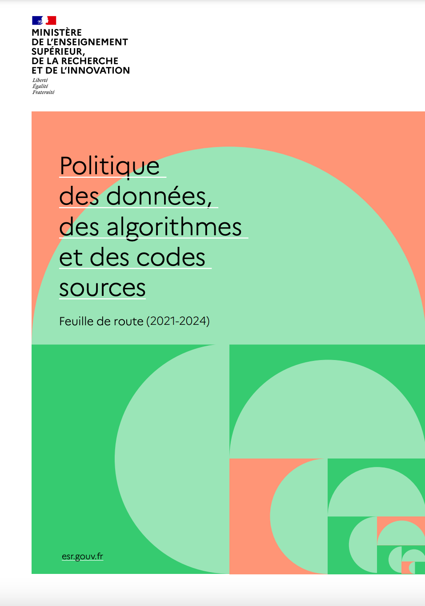
```
]

.pull-right[
[Politique des données, des algorithmes et des codes sources](https://cache.media.enseignementsup-recherche.gouv.fr/file/politique_des_donnees/50/1/Strategie-donnees-algorithmes-codes-210922_1419501.pdf), 2021-2024.

* Structurer, ouvrir et partager les données de recherche - Action 6
* Suivre l'ouverture des données et des codes de la recherche : Baromètre de la science ouverte - Action 7 
* Accompagner les chercheurs dans la gestion des données et le « FAIR by design » - Action 9
* Collecter, préserver et partager les codes sources – Software Heritage - Action 11
* Accélérer les demandes d'accès des chercheurs aux données publiques - Actions 18 & 9 
* Favoriser l'accès des chercheurs aux données d'intérêt général -  Action 20
* Mettre en place des identifiants uniques et pérennes - Actions 22 à 27
* Accompagner l’adoption de licences libres - Action 45
]

---

# La science ouverte en France

* Plan national pour la science ouverte, 2018 et 2021.

> « La France s’engage pour que les résultats de la recherche scientifique soient ouverts à tous, chercheurs, entreprises et citoyens, sans entrave, sans délai, sans paiement. »

.center[
```{r echo=FALSE, out.height=300, out.width=250}

```
]


---

# Le plan national pour la science ouverte 1, 2018

.center[
```{r echo=FALSE, out.height=250, out.width=200}
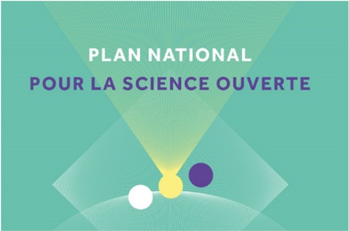
```
]

**Axe 2, structurer et ouvrir les données de la recherche**
* Rendre obligatoire la diffusion ouverte des données de recherche issues de programmes financés par appels à projets sur fonds publics.
* Créer la fonction d’administrateur des données et le réseau associé au sein des établissements.
* Créer les conditions et promouvoir l’adoption d’une politique de données ouvertes associées aux articles publiés par les chercheurs.
  
  
---

class:middle

# Le plan national pour la science ouverte 2, 2021


**Axe 2 : structurer, partager et ouvrir les données de la recherche**
* Mettre en œuvre l’obligation de diffusion des données de recherche financées sur fonds publics
* Créer Recherche Data Gouv, la plateforme nationale fédérée des données de recherche
* Promouvoir l’adoption d’une politique de données sur l’ensemble du cycle des données de la recherche, pour les rendre faciles à trouver, accessibles, intéropérables et réutilisables (FAIR)

**Axe 3 : ouvrir et promouvoir les codes sources produits par la recherche**
* Valoriser et soutenir la diffusion sous licence libre des codes sources issus de recherches financées sur fonds publics
* Mettre en valeur la production des codes sources de l’enseignement supérieur, de la recherche et de l’innovation
* Définir et promouvoir une politique en matière de logiciels libres

---

class: middle

# Quels bénéfices pour le producteur de données ?

* Une **conformité** avec les exigences des financeurs en faveur de la science ouverte
* Davantage de **transparence** dans le processus de recherche
* Une meilleure **visibilité** pour les chercheurs
* Davantage d’**impact** potentiel de la recherche
* Une plus grande **efficacité** (et une meilleure gestion des coûts de gestion)
* De meilleures possibilités de **collaboration**
* Davantage de **citations** :
  * Colavizza, Giovanni, Iain Hrynaszkiewicz, Isla Staden, Kirstie Whitaker, et Barbara McGillivray. 2020. « The citation advantage of linking publications to research data ». PLOS ONE 15 (4): e0230416. https://doi.org/10.1371/journal.pone.0230416.
  
---

class: middle

# Pourquoi diffuser si largement ? 

* Utilité sociale : un [exemple](https://madada.fr/demande/donnees_relatives_a_la_concentra) 
* Utilité politique (informer le débat public) 
* Utilité économique (volonté européenne d'une réutilisation par des entreprises) 
* Retour sur investissement de la recherche publique (restituer aux citoyens le produit de ce qu'ils ont financé)
* Constitution d’un patrimoine scientifique nativement numérique

---

class: middle

# Les données de la recherche : définitions - 1

>"Enregistrements factuels (chiffres, textes, images et sons) qui sont utilisés comme sources principales pour la recherche scientifique et sont généralement reconnus par la communauté scientifique comme nécessaires pour valider des résultats de recherche."

OECD. 2007. « OECD Principles and Guidelines for Access to Research Data from Public Funding ». https://www.oecd.org/sti/inno/38500813.pdf.

---

class: middle

# Les données de la recherche : définitions - 2

>« Research data means data in the form of facts, observations, images, computer program results, recordings, measurements or experiences on which an argument, theory, test or hypothesis, or another research output is based. 
Data may be numerical, descriptive, visual or tactile. It may be raw, cleaned or processed, and may be held in any format or media. »

DANS, « What Is Research Data », 2017. https://www.ands.org.au/__data/assets/pdf_file/0006/731823/Whatis-research-data.pdf 


---

class: middle

# Différents types de données ?

--

.center[
```{r echo=FALSE, out.height=300, out.width=600}
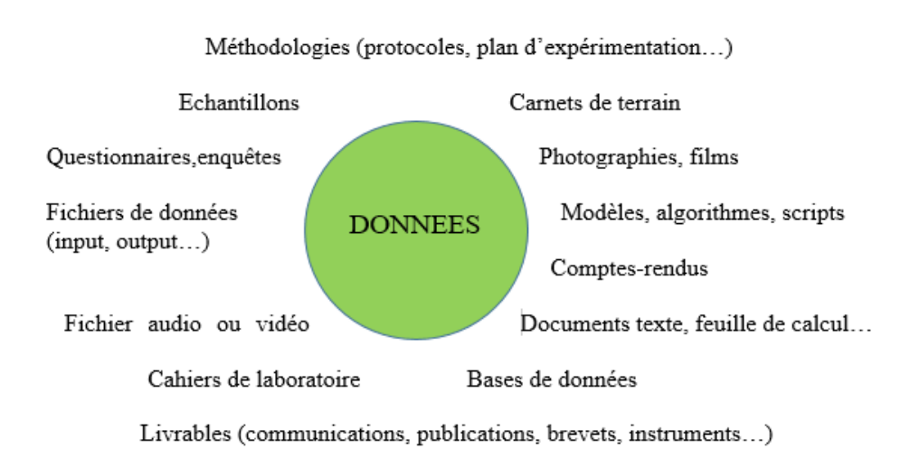
```
]

&nbsp;

<small>Source : Rivet, Alain, Marie-Laure Bachèlerie, Auriane Denis-Meyere, et Delphine Tisserand. 2018. « Traçabilité des activités de recherche et gestion des connaissances : Guide pratique de mise en place ». http://qualite-en-recherche.cnrs.fr/IMG/pdf/guide_tracabilite_activites_recherche_gestion_connaissances.pdf.</small>


---


# Différents types de données - 1

* **Données d’observation** capturées en temps réel : habituellement uniques, impossible à  reproduire
  * *Ex.: mesures sismiques, images d’une étoile,  enquêtes sociologiques, fouilles archéologiques…*

* **Données d’expérimentation** : obtenues à partir d’équipements de laboratoire
souvent reproductibles, parfois coûteuses
  * *Ex.: résultats de réactions chimiques,  observations sur des individus en situation de test…*

* **Données computationnelles** : générées par des modèles informatiques
souvent reproductibles si le modèle est  correctement documenté
  * *Ex.: modélisation du changement climatique, « reproduction » du  Big Bang, modèles économiques…*

&nbsp;

<small>Source : Ancelin-Fabre, Justine. 2021. « Rédiger un plan de gestion pour ses données de recherche ». https://urfist.chartes.psl.eu/sites/default/files/docs/20210601_ancelin-fabre_pgd.pdf.</small>

---

# Différents types de données - 2

* **Records** (C. Borgman) : documents témoignant d’un phénomène ou  d’une activité humaine, uniques ou non (=> "traces" dans la traduction française)
  * *Ex.: fonds de photographies, documents d’archives, textes de loi,  ouvrages littéraires…*

* **Données compilées ou dérivées** : issues du traitement de données brutes
souvent reproductibles mais coûteuses
  * *Ex.: bases de données compilées, corpus textuel préparé pour le  TDM…*

* **Données « de référence »** : validées par la communauté, réutilisables
  * *Ex.: décodage du génome humain, certaines données astronomiques…*

&nbsp;

<small>Source : Ancelin-Fabre, Justine. 2021. « Rédiger un plan de gestion pour ses données de recherche ». https://urfist.chartes.psl.eu/sites/default/files/docs/20210601_ancelin-fabre_pgd.pdf.</small>


---

class: middle

# Cerner le périmètre des données

Dans le cadre du plan de gestion des données, *on ne prendra pas en compte ces productions* : 

* Analyses préliminaires et projets de documents scientifique
* Programmes de travaux futurs
* Examens par les pairs
* Communications personnelles avec des collègues
* Objets matériels
* **Publications scientifiques**
* Supports de formations
* Données administratives

*Attention, elles constituent des archives et certaines sont à conserver de façon pérenne.* (voir : Référentiel de gestion des archives de la recherche)

---

# Le cycle de vie des données - 1

*Un peu trop parfait pour être vrai...*

.center[
```{r echo=FALSE, out.height=400, out.width=500}
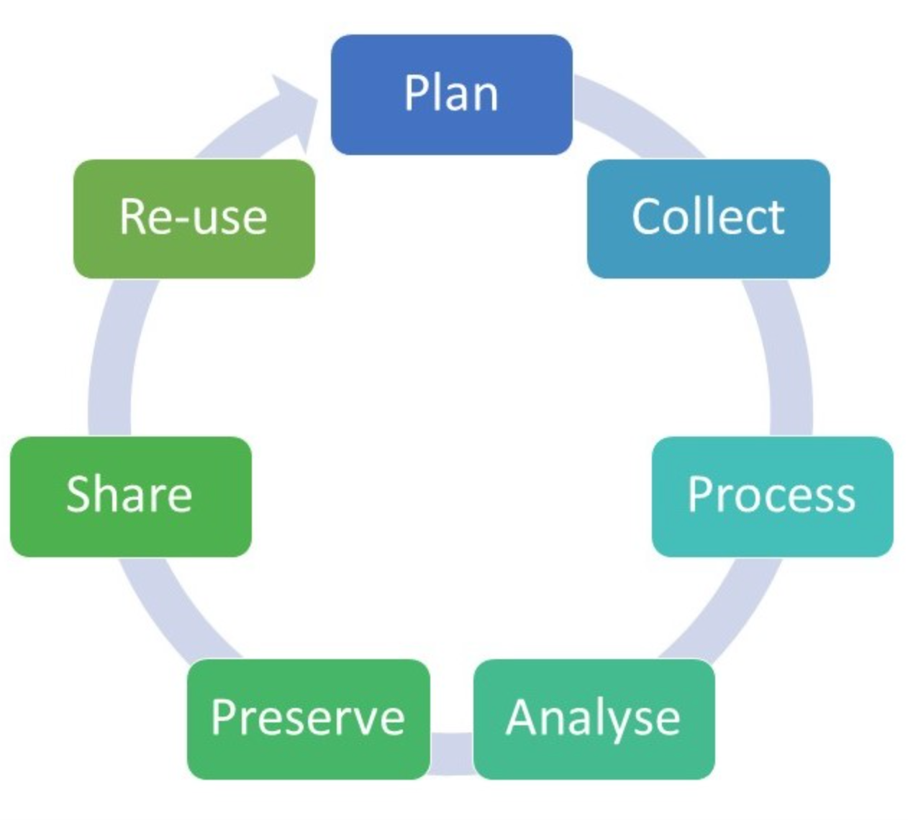
```
]


---

# Le cycle de vie des données - 2

*Plus souvent itératif*

.center[
```{r echo=FALSE, out.height=400, out.width=600}
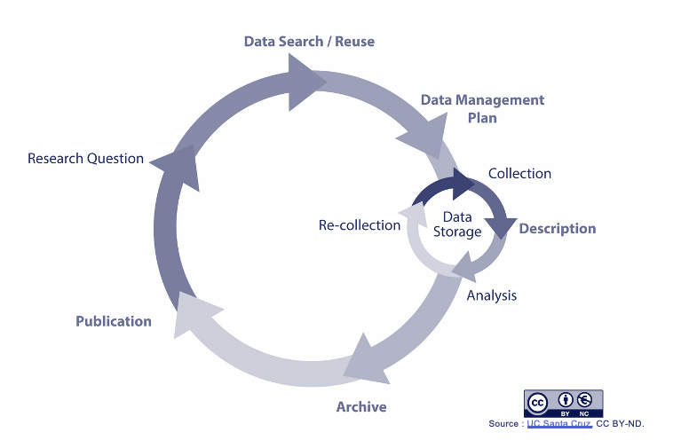
```
]


---

class: middle

# Pourquoi ouvrir les données ? 

* 50 % des expériences sont considérées comme **non-reproductibles**. 
* 80 % des données produites ces 20 dernières années seraient **perdues**.
* 93 % des établissements d’enseignement supérieur n’ont pas de démarche de plan de gestion des données de la recherche.
* 90 % des chercheurs interrogés dans le cadre d’un sondage européen disent effectuer de manière individuelle le stockage, l’archivage ou la transmission de leurs données.
* 33 % de ces mêmes chercheurs n’ont jamais entendu parler des plans de gestion de données ou estiment qu’ils n’en ont pas besoin. 
* Plus de 80 % des données produites sont **stockées ailleurs que dans des entrepôts**. 

&nbsp;

*DATACC. « Gestion des données : une nouvelle exigence, de nouvelles compétences », 2020.* https://www.datacc.org/bonnes-pratiques/adopter-un-plan-de-gestion-des-donnees/gestion-des-donnees-une-nouvelle-exigence-de-nouvelles-competences/

---

class: middle

# Les données sont fragiles !

**Chaque année augmente de 17% le risque de non-disponibilité des données.**

.center[
```{r echo=FALSE, out.height=300, out.width=500}
knitr::include_graphics("img/perte-donnees.png")
```
]

<small>Vines et al., The Availability of Research Data Declines Rapidly with Article Age. Current Biology 24 , 94–97, January 6, 2014 https://doi.org/10.1016/j.cub.2013.11.014</small>

---

class: middle

# Un enjeu, préserver le patrimoine scientifique

.pull-left[
```{r echo=FALSE, out.height=300, out.width=200}
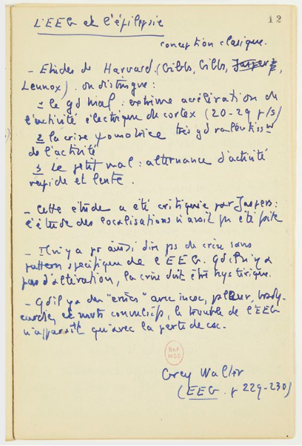
```
]

.pull-right[
```{r echo=FALSE, out.height=300, out.width=200}
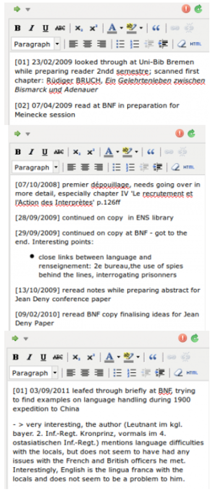
```
]

Sources :
* Fonds Michel Foucault. Notes de lecture et manuscrits. Notes de lecture des débuts, 1952-1955. Neurophysiologie Lagache & EEG. NAF 28730 (44 A). https://gallica.bnf.fr/ark:/12148/btv1b525128619/f12.item
* Heimburger, Franziska. « Gérer la documentation II - une approche possible utilisant Zotero ». La boîte à outils des historiens (blog), 2012. http://www.boiteaoutils.info/2012/11/gerer-la-documentation-ii-une-approcha/


---

class: middle

# En d'autres termes, faire de la curation de données

>« Les activités de curation de données permettent de faciliter la découverte et la récupération de données, de maintenir la qualité des données, de leur ajouter de la valeur et d'en fournir pour de futures réutilisations. Ce nouveau champ inclut la représentation, l'archivage, l'authentification, la gestion, la préservation, la récupération, et l'utilisation. »

&nbsp;

* « Frequently Asked Questions about Data Curation ». s. d. Digital Humanities Data Curation (blog). Consulté le 3 octobre 2021. https://guide.dhcuration.org/faq/.
* Puren, Marie. 2021. « Créer son plan de gestion des données ». École thématique. Lille, France: MESH, Lille. https://hal.archives-ouvertes.fr/hal-03183724.

---

class: middle

.pull-left[
# Cadre européen de l'ouverture des données - 1
]

.pull-right[
```{r echo=FALSE, out.height=68, out.width=98}
knitr::include_graphics("img/europe.png")
```
]

[Directive européenne sur les données ouvertes et la réutilisation des informations du secteur public](https://eur-lex.europa.eu/eli/dir/2019/1024/oj/eng), juin 2019 (2019/1024)

>« Les informations du secteur public constituent une **source extraordinaire de données qui peuvent contribuer à améliorer le marché intérieur** et à développer de nouvelles applications pour les consommateurs et les personnes morales. L'utilisation intelligente de données, y compris leur traitement par des applications utilisant l'intelligence artificielle, peut avoir un **effet de transformation sur tous les secteurs de l'économie**. » (considérant 9)

---

class: middle

.pull-left[
# Cadre européen de l'ouverture des données - 2
]

.pull-right[
```{r echo=FALSE, out.height=68, out.width=98}
knitr::include_graphics("img/europe.png")
```
]

[Une stratégie européenne pour les données, communication de la commission au parlement](https://ec.europa.eu/info/sites/default/files/communication-european-strategy-data-19feb2020_fr.pdf), février 2020 (COM(2020) 66 final)

> «  Outre la création de **neuf espaces européens communs des données**, les travaux se poursuivront sur le nuage européen pour la science ouverte (**EOSC**), qui offre un **accès ininterrompu et une réutilisation fiable des données de la recherche aux chercheurs européens, aux innovateurs, aux entreprises et aux citoyens**, grâce à un environnement distribué des données fiable et ouvert et à des services connexes. »

Ouverture d’EOSC au secteur privé à partir de 2024

---

# Cadre juridique français de l'ouverture des données

.pull-left[
```{r echo=FALSE, out.height=400, out.width=300}
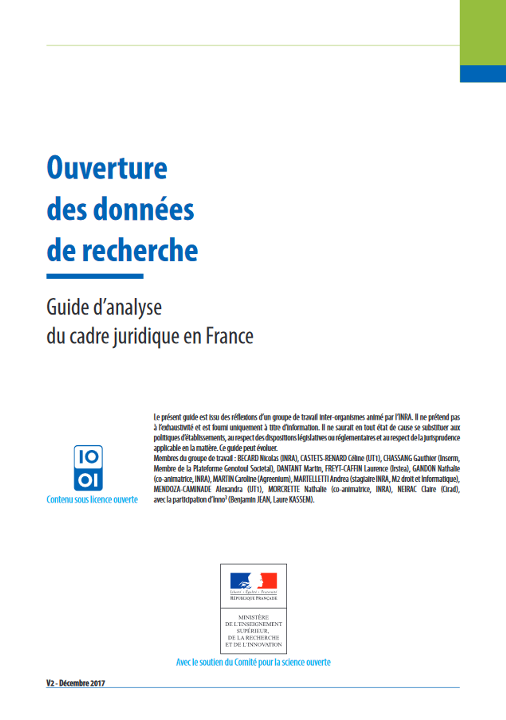
```
]

.pull-right[
Becard, Nicolas, Céline Castets-Renard, Gauthier Chassang, Martin Dantant, Laurence Freyt-Caffin, Nathalie Gandon, Caroline Martin, et al. 2017. « **Ouverture des données de la recherche. Guide d’analyse du cadre juridique en France** », 45 p. https://doi.org/10.15454/1.481273124091092E12.

&nbsp;

Cas pratiques en SHS : « **Ethique et droit** ». https://ethiquedroit.hypotheses.org/.
]

---

# Loi pour une République numérique, 2016 - 1

.center[
```{r echo=FALSE, out.height=100, out.width=100}
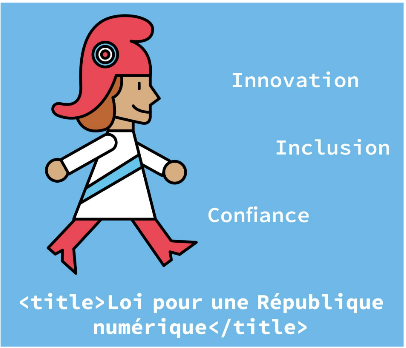
```
]

**Titre Ier : la circulation des données et du savoir : article 6**

Les administrations publient en ligne les documents administratifs suivants :
>« 1° Les documents qu'elles communiquent en application des procédures prévues au présent titre, ainsi que leurs versions mises à jour ;

>[...]

>« 3° Les bases de données, mises à jour de façon régulière, qu'elles produisent ou qu'elles reçoivent et qui ne font pas l'objet d'une diffusion publique par ailleurs ;

>« 4° Les **données, mises à jour de façon régulière, dont la publication présente un intérêt économique, social, sanitaire ou environnemental**.


---

# Loi pour une République numérique, 2016 - 2

.center[
```{r echo=FALSE, out.height=100, out.width=100}

```
]

**Open research data : article 30**

>« II.- Dès lors que les données issues d'une activité de recherche **financée au moins pour moitié** par des dotations de l'Etat, des collectivités territoriales, des établissements publics, des subventions d'agences de financement nationales ou par des fonds de l'Union européenne ne sont pas protégées par un droit spécifique ou une réglementation particulière et qu'elles ont été rendues publiques par le chercheur, l'établissement ou l'organisme de recherche, **leur réutilisation est libre**.

>« III.- L'éditeur d'un écrit scientifique mentionné au I ne peut limiter la réutilisation des données de la recherche rendues publiques dans le cadre de sa publication.


---

class: middle

# Cadre juridique

✅   Open data : **principe de communication et de réutilisation libre et gratuite**

* En Europe : Directive PSI
* En France : 
  * Lois CADA, Valter et loi pour une République numérique
  * Code des relations entre le public et l’administration

En pratique, tout dépend du type de données :

* ✅   Communication **obligatoire**
  * Directive INSPIRE : géographie
  * Convention d’Aarhus : environnement
  
---

# Cadre juridique

🔴   Communication **interdite** des données portant atteinte :

* A la défense et la politique étrangère de la France, aux délibérations du gouvernement, au pouvoir exécutif
* A la sûreté de l’État, la sécurité publique, à la sécurité des personnes , à la sécurité des biens de l’établissement et de ses systèmes d’informations
* Au secret professionnel (médical, etc.)
* Au secret industriel et commercial

🔶   Communication possible **sous conditions** de données :

* Protégées par le droit d’auteur ou autres droits de propriété intellectuelle
* Relatives à des personnes privées (données personnelles, vie privée)
* Soumises au secret statistique
* Liées à un contrat avec un tiers non soumis à une obligation de service public
* Présentant des risques pour la protection du potentiel scientifique et technique de la nation (« unité protégée » ou « Zone à régime restrictif »)


---

# Propriété intellectuelle

### Les données sont-elles protégées par le droit d’auteur ?

* ✅   **Oui** pour les « œuvres » même sans caractère artistique, si elles présentent un degré minimal d’« originalité »: textes, discours, photos, vidéos, musique, cartes, sculptures…
* ✅   **Oui** pour le code informatique
* 🔴   **Non** pour des informations purement factuelles (mesures, comptages…)
* 🔴   **Non** pour les œuvres tombées dans le domaine public (pour être précis il reste un droit moral, inaliénable)

*Le fait que la collecte des données ait demandé un investissement (humain, matériel, financier) n’est pas créateur de droit d’auteur.*

### Autres droits de propriété intellectuelle :

* Marques, dessins, modèles
* Brevets, éléments brevetés
* Droits des bases de données


---

class: middle

# A qui appartiennent vos productions ?

**A votre employeur**, dans la plupart des cas

* Ce qui est produit dans le cadre de nos mission est
considéré comme un document administratif (au sens de la loi Valter).
* *Attention* ! Pour les doctorants : si la thèse est
cofinancée ou réalisée en collaboration avec un
partenaire privé => il faut se reporter au contrat.

* Cas particulier : je suis **chercheur ou enseignant-chercheur** :
mes œuvres (écrits, cartes, photographies, plans, etc.) qui sont originales et donc soumises au droit d’auteur m’appartiennent (exception – loi DADVSI 2006-961). **Mais le reste appartient bien à mon employeur.**

&nbsp;

<small>Morcrette, Nathalie, et Nathalie Gandon. 2016. « Cadre juridique des données de la recherche : Formation ». https://anfdonnees2016.sciencesconf.org/data/pages/Cadre_juridique.pdf.</small>

---

class: middle

# Principes d'ouverture des données

*« As open as possible, as closed as necessary. »*

**Un principe d’ouverture par défaut ;
Des limitations en fonction du type de données.**

Mise en œuvre : production de données **FAIR**

.center[
```{r echo=FALSE, out.height=200, out.width=600}
knitr::include_graphics("img/FAIR1.jpg")
```
]

.center[
<small>Logo FAIR : [SangyaPundir](https://commons.wikimedia.org/wiki/File:FAIR_data_principles.jpg). CC:BY-SA4.0.</small>
]

---

class: middle

# Principes FAIR

--

.center[
```{r echo=FALSE, out.height=350, out.width=550}
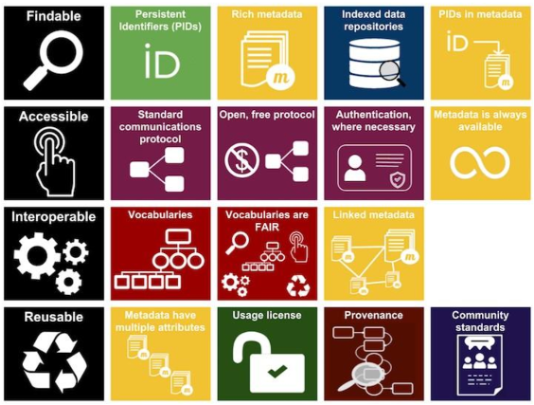
```

Détail des principes FAIR : https://www.force11.org/group/fairgroup/fairprinciples 

<small>Image : [ANDS](https://www.ands.org.au/working-with-data/fairdata/training). CC:BY4.0.</small>
]

---

# Données FAIR et données ouvertes

.center[
```{r echo=FALSE, out.height=350, out.width=550}
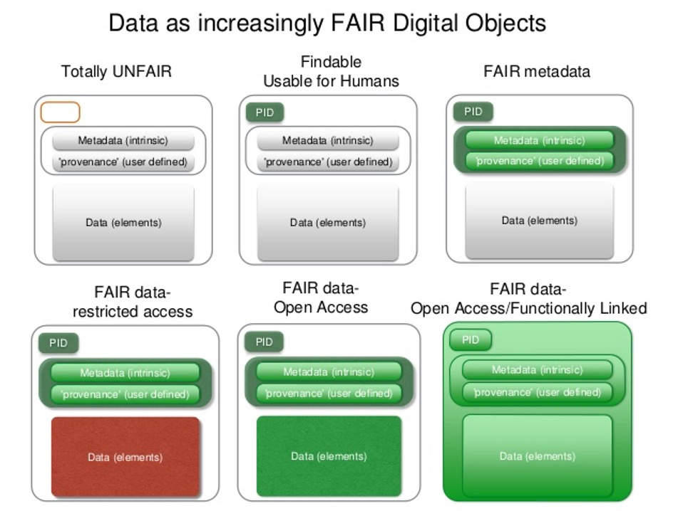
```
]

Mons B, NeylonC,VelteropJ, Dumontier M, da Silva Santos LOB, Wilkinson MD. Cloudy, increasingly FAIR; revisiting the FAIR Data guiding principles for the European Open Science Cloud. Information Services & Use. 2017;37(1):49‑56.
https://doi.org/10.3233/ISU-170824


---

background-color: #bebebe
class: middle

# Et vos données ?

* Quelles sont vos pratiques pour les produire et les conserver ?
* Pourraient-ils intéresser d’autres chercheurs ou le grand public ?
* Avez-vous envisagé de les diffuser en complément du texte de votre thèse, de votre projet de recherche ? 
* A quels freins ou difficultés avez-vous pensé ? 

---

background-color: #bebebe
class: middle

# Pourquoi décrire et documenter des jeux de données ? - 1

## Exercice

*Voici des jeux de données déposés sur Zenodo. Lesquels êtes-vous en mesure de décrire ? Lesquels pourriez-vous réutiliser ?*

* https://github.com/carenes/urfist_bdx_DMP/blob/master/materiel/exercice_jeux-donnees.docx 


---

background-color: #bebebe
class: middle

# Pourquoi décrire et documenter des jeux de données ? - 2

Trois jeux particulièrement contrastés

* Lomazzi, Vera. (2017). Supplementary materials for "Testing the goodness of the EVS gender role attitudes scale" [Data set]. Bulletin of Sociological Methodology/Bulletin de Méthodologie Sociologique. Zenodo. http://doi.org/10.5281/zenodo.375612
* Biswas, Rahul, Cinabro, David, & Kessler, Rick. (2018). simlib_minion (Version 2) [Data set]. Zenodo. http://doi.org/10.5281/zenodo.1145822
* Macario, A. (2013). Swath Bathymetry Pitman fracture zone [Data set]. Zenodo. http://doi.org/10.5281/zenodo.7515 


---

class: center, inverse, middle

# 2.	Le PGD en théorie : définition et modèles

---

class: middle

# Le PGD en quelques dates

* 1966 : esquisses de DMP dans le domaine de l’aéronautique
* 1973 : la NASA publie un rapport technique qui s’apparente à un DMP.
* 2007 : le Wellcome trust (Royaume-Uni), aujourd’hui membre du Plan S, requiert la mise en place de DMP pour les projets qu’il finance
* 2007 : lignes directrices de l’OCDE
* 2011 : mise en place de DMP par la National Science Foundation (Etats-Unis) pour les projets financés.
* 2014 : DMP pour les projets financés dans le cadre de H2020
* 2019 : l’ANR requiert la mise en place de DMP pour les projets qu’elle finance

&nbsp;

Sources :
* DATACC. « Gestion des données : une nouvelle exigence, de nouvelles compétences », 2020. https://www.datacc.org/bonnes-pratiques/adopter-un-plan-de-gestion-des-donnees/gestion-des-donnees-une-nouvelle-exigence-de-nouvelles-competences/.
* Chronologie inspirée de : Smale, Nicholas, et al. « The History, Advocacy and Efficacy of Data Management Plans ». BioRxiv, octobre 2018. www.biorxiv.org, https://doi.org/10.1101/443499


---

class: middle

# Le plan de gestion des données : définition

>Un document synthétique qui aide à organiser et anticiper toutes les étapes du cycle de vie de la donnée. Il explique pour chaque jeu de données comment seront gérées les données d’un projet, depuis leur création ou collecte jusqu’à leur partage et leur archivage.

Source : INIST-CNRS, [doranum](https://doranum.fr/plan-gestion-donnees-dmp/fiche-synthetique/)

Le DMP est un document **évolutif**, demandé, en général, à **trois moments** du projet.


---

class: middle

# Quand rédiger son plan de gestion des données ?

* Collecter des éléments **au plus tôt !**
* Dans les appels européens, la science ouverte devient un **critère d'excellence**, vous devrez témoigner de **bonnes pratiques**.


---

class: middle 

# Checklist données dès la réponse à l'AAP - 1

**Expérience passée** :
* Avez-vous déjà déposé des données sur un entrepôt ?
* Avez-vous déjà un ORCID ou un autre identifiant chercheur ?

**Méthodologie prévue pour le projet** :

* Pensez aux principes **FAIR** pour le projet, par exemple :
  * Résultats **Faciles à trouver, Accessibles, Intéropérables** : parmi vos livrables, prévoyez-vous le **partage** des données sur un entrepôt de confiance, l’ouverture des codes ?
  * Résultats **Réutilisables** : quelle **documentation** allez-vous fournir pour que vos données et vos codes puissent être réutilisés ? Une publication de **data paper** à prévoir ?
  * Si les données et codes ne peuvent être ouverts, mentionner qu’un DOI leur seront attribués pour que leur description soit Faciles à trouver

---

class: middle 

# Checklist données dès la réponse à l'AAP - 2

**Pratiques envisagées** :

  * Quels **types** de données prévoyez-vous de collecter ? Avez-vous l’intention de réutiliser des données existantes ?
  * Recueillez-vous des **données personnelles** ou des données **sensibles** ? : si oui, anticiper les questions de sécurisation du stockage des données, prévoir un contact préalable avec le délégué à la protection des données (RGPD), le RSSI ou le fonctionnaire sécurité défense, ceci afin d’indiquer que ces questions ont été anticipées.
  * **Partage** des données : avez-vous déjà ciblé un entrepôt pour y déposer vos publications ?

**Appui à la mise en œuvre** :

* Politique institutionnelle de l’établissement si elle existe
* Politique française, Plan national pour la science ouverte 2 (et projet français d’entrepôt Recherche.data.gouv.fr à venir)
* Services d'appui de l’établissement : cf. personnes ressources

---


# Le plan de gestion des données en bref

.center[
```{r echo=FALSE, out.height=450, out.width=800}
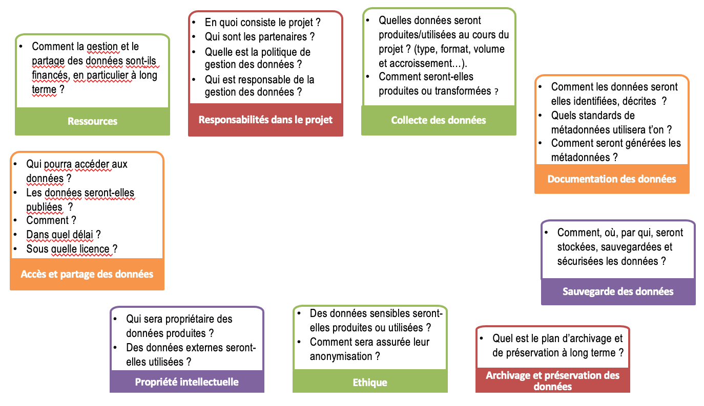
```
]

Source :  Cocaud, Sylvie, et Dominique l’Hostis. “Pourquoi et comment rédiger un plan de gestion de données ?,” 2019. https://hal.inrae.fr/hal-02791507


---

class:middle

# Exigences des financeurs de la recherche pour les PGD

**ANR :** 
* DMP obligatoire pour tout projet, non évalué
* Pas d’obligation d’ouverture des données

**Europe, Horizon Europe :** 
* DMP obligatoire pour tout projet, évalué
* Critère d'excellence selon les appels, bonnes pratiques de gestion des données selon les principes FAIR
* Ouverture des données si leur régime juridique le permet

*Europe, H2020 :*
* *Si pilote, DMP obligatoire pour tout projet*
* *Si pilote, ouverture des données si leur régime juridique le permet*


---

class: middle

# Les agences françaises et la science ouverte

Signature d’une déclaration conjointe en faveur de la science ouverte
par un réseau d’agences françaises de financement de la recherche en 2020
* ANR
* ADEME
* ANSES
* INCa
* INSERM/ANRS

https://anr.fr/fileadmin/documents/2020/CP_Declaratation_SO_29062020_VDEF__.pdf

---

class: middle

# Le modèle de l'ANR - présentation

[Modèle](https://anr.fr/fileadmin/documents/2019/ANR-modele-PGD.pdf) suivant le cycle de vie des données

Informations générales
1. **Description** des données et collecte ou réutilisation des données
2. **Documentation** et qualité des données
3. **Stockage** et sauvegarde pendant le processus de recherche
4. Exigences légales et **éthiques**, codes de conduite
5. **Partage** des données et conservation à long terme
6. Responsabilités et **ressources** en matière de gestion de données


---

# Le modèle de l'ANR - Description et documentation

- Informations générales
- Renseignements administratifs
- **1. Description des données et collecte ou réutilisation de données**
  - 1a. Comment de **nouvelles données** seront-elles recueillies ou produites et/ou comment des données préexistantes seront-elles réutilisées ?
  - 1b. Quelles données (**types, formats et volumes** par ex.) seront collectées ou produites ?

- **2. Documentation et qualité des données**
  - 2a. Quelles **métadonnées** et quelle **documentation** (par exemple méthodologie de collecte et mode d'organisation des données) accompagneront les données ?
  - 2b. Quelles mesures de contrôle de la **qualité** des données seront mises en œuvre ? 	


---

# Le modèle de l'ANR - Stockage et exigences légales

- **3. Stockage et sauvegarde pendant le processus de recherche**
  - 3a. Comment les données et les métadonnées seront-elles **stockées** et **sauvegardées** tout au long du processus de recherche ?
  - 3b. Comment la **sécurité** des données et la protection des données **sensibles** seront-elles assurées tout au long du processus de recherche ? 
  
- **4. Exigences légales et éthiques, codes de conduite**
  - 4a. Si des données à **caractère personnel** sont traitées, comment le respect des dispositions de la législation sur les données à caractère personnel et sur la sécurité des données sera-t-il assuré ?
  - 4b. Comment les autres questions juridiques, comme la titularité ou les droits de **propriété intellectuelle** sur les données, seront-elles abordées ? Quelle est la législation applicable en la matière ? 
  - 4c. Comment les éventuelles **questions éthiques** seront-elles prises en compte, les codes déontologiques respectés ?


---

# Le modèle de l'ANR - Partage et responsabilités

- **5. Partage des données et conservation à long terme**
  - 5a. **Comment et quand** les données seront-elles partagées ? Y-a-t-il des restrictions au partage des données ou des raisons de définir un **embargo** ?
  - 5b. Comment les données à conserver seront-elles sélectionnées et où seront-elles **préservées** sur le long terme (par ex. un entrepôt de données ou une archive) ? 
  - 5c. Quelles **méthodes** ou quels outils **logiciels** seront nécessaires pour accéder et utiliser les données ?
  - 5d. Comment l'attribution d'un **identifiant** unique et pérenne (comme le DOI) sera-t-elle assurée pour chaque jeu de données ?

- **6. Responsabilités et ressources en matière de gestion des données**
  - 6a. **Qui** (par exemple rôle, position et institution de rattachement) sera responsable de la gestion des données (c'est-à-dire le gestionnaire des données) ?
  - 6b. Quelles seront les **ressources** (budget et temps alloués) dédiées à la gestion des données permettant de s'assurer que les données seront FAIR (Facile à trouver, Accessible, Interopérable, Réutilisable) 
  

---

class: middle
background-color: #bebebe

# Le modèle de l'ANR - exemples

LipInTB / Jean-François Cavalier. 2021. https://dmp.opidor.fr/plans/4624/export.pdf

&nbsp;

IMPRINT / Jonathan Lenoir. 2020.
https://dmp.opidor.fr/plans/5082/export.pdf

&nbsp;

Ou : https://dmp.opidor.fr/public_plans

&nbsp;

**Exercice** : choisissez et lisez ce PGD au regard des questions du modèle de l'ANR, qu'en pensez vous ?
https://anr.fr/fileadmin/documents/2019/ANR-modele-PGD.pdf 


---

class: middle

# Le modèle Horizon Europe - Data Summary

https://ec.europa.eu/info/funding-tenders/opportunities/docs/2021-2027/horizon/temp-form/report/data-management-plan-template_he_en.docx 

## 1.	Data Summary

* Will you **re-use** any existing data and what will you re-use it for? State the reasons if re-use of any existing data has been considered but discarded.
* What **types and formats** of data will the project generate or re-use?
* What is the **purpose** of the data generation or re-use and its relation to the objectives of the project?
* What is the **expected size** of the data that you intend to generate or re-use?
* What is the **origin/provenance** of the data, either generated or re-used?
* To whom might your data be useful (**'data utility'**), outside your project?


---

class: middle

# Le modèle Horizon Europe - Fair data : Findable


## 2.	FAIR data

### 2.1.	Making data **findable**, including provisions for metadata
* Will data be identified by a **persistent identifier**?
* Will **rich metadata** be provided to allow discovery? What metadata will be created? What disciplinary or general standards will be followed? In case metadata standards do not exist in your discipline, please outline what type of metadata will be created and how.
* Will search **keywords** be provided in the metadata to optimize the possibility for discovery and then potential re-use?
* Will metadata be offered in such a way that it can be harvested and indexed? 


---

class: middle

# Le modèle Horizon Europe - Fair data : Accessible - 1 

### 2.2.	Making data **accessible** : **Repository**

  * Will the data be deposited in a **trusted repository**?
  * Have you explored appropriate arrangements with the identified repository where your data will be deposited? 
  * Does the repository ensure that the data is assigned an **identifier**? Will the repository resolve the identifier to a digital object? 


---

# Le modèle Horizon Europe - Fair data : Accessible - 2

### 2.2.	Making data **accessible** : **Data**
* Will all data be made **openly available**? If certain datasets cannot be shared (or need to be shared under restricted access conditions), explain why, clearly separating **legal and contractual reasons from intentional restrictions**. Note that in multi-beneficiary projects it is also possible for specific beneficiaries to keep their data closed if opening their data goes against their legitimate interests or other constraints as per the Grant Agreement.
* If an **embargo** is applied to give time to publish or seek protection of the intellectual property (e.g. patents), specify why and how long this will apply, bearing in mind that research data should be made available as soon as possible.
* Will the data be accessible through a **free and standardized access protocol**?
* If there are **restrictions** on use, how will access be provided to the data, both during and after the end of the project?
* How will the identity of the person accessing the data be ascertained?
* Is there a need for a **data access committee** (e.g. to evaluate/approve access requests to personal/sensitive data)?
  

---

class: middle

# Le modèle Horizon Europe - Fair data : Accessible - 3

### 2.2.	Making data **accessible** : **Metadata**
  * Will **metadata** be made openly available and licenced under a public domain dedication **CC0**, as per the Grant Agreement? If not, please clarify why. Will metadata contain information to enable the user to access the data?
  * How long will the data remain **available and findable**? Will metadata be guaranteed to remain available after data is no longer available?
  * Will **documentation or reference** about any software be needed to access or read the data be included? 
  * Will it be possible to include the **relevant software** (e.g. in open source code)?


---

class: middle

# Le modèle Horizon Europe - Fair data : Interopérable

### 2.3.	Making data **interoperable**

* What data and metadata **vocabularies, standards, formats or methodologies** will you follow to make your data interoperable to allow data exchange and re-use within and across disciplines? Will you follow community-endorsed interoperability best practices? Which ones? 
* In case it is unavoidable that you use uncommon or generate project **specific ontologies or vocabularies**, will you provide mappings to more commonly used ontologies? Will you openly publish the generated ontologies or vocabularies to allow reusing, refining or extending them?
* Will your data include **qualified references to other data** (e.g. other data from your project, or datasets from previous research)?

---

# Le modèle Horizon Europe - Fair data : Réutilisable

### 2.4.	Increase data **re-use**

* How will you provide **documentation needed to validate data analysis and facilitate data re-use** (e.g. **readme files** with information on methodology, codebooks, data cleaning, analyses, variable definitions, units of measurement, etc.)?
* Will your data be made **freely available** in the public domain to permit the widest re-use possible? Will your data be licensed using standard reuse licenses, in line with the obligations set out in the Grant Agreement?
* Will the data produced in the project be **useable** by third parties, in particular after the end of the project?
* Will the **provenance** of the data be thoroughly documented using the appropriate standards?
* Describe all relevant data **quality assurance processes**.
* Further to the FAIR principles, DMPs should also address **research outputs** other than data, and should carefully consider aspects related to the allocation of resources, data security and ethical aspects.

---

class: middle

# Le modèle Horizon Europe - Autres résultats de recherche

## 3.	Other research outputs
* In addition to the management of data, beneficiaries should also consider and plan for the management of **other research outputs** that may be generated or re-used throughout their projects. Such outputs can be either digital (e.g. **software, workflows, protocols, models**, etc.) or physical (e.g. new materials, antibodies, reagents, samples, etc.).
* Beneficiaries should consider which of the questions pertaining to FAIR data above, can apply to the management of other research outputs, and should strive to provide sufficient detail on how their research outputs will be managed and shared, or made available for re-use, in line with the FAIR principles.


---

class: middle

# Le modèle Horizon Europe - Coûts

## 4.	Allocation of resources
* What will the **costs** be for making data or other research outputs FAIR in your project (e.g. direct and indirect costs related to storage, archiving, re-use, security, etc.) ?
* How will these be covered? Note that costs related to research data/output management are eligible as part of the Horizon Europe grant (if compliant with the Grant Agreement conditions)
* Who will be **responsible** for data management in your project?
* How will **long term preservation** be ensured? Discuss the necessary resources to accomplish this (costs and potential value, who decides and how, what data will be kept and for how long)?


---

class: middle

# Le modèle Horizon Europe - Sécurité

## 5.	Data security
* What provisions are or will be in place for **data security** (including data recovery as well as secure storage/archiving and transfer of sensitive data)?
* Will the data be safely stored in **trusted repositories** for long term preservation and curation?


---

# Le modèle Horizon Europe - Ethique, Autres

## 6.	Ethics
* Are there, or could there be, any **ethics or legal issues** that can have an impact on data sharing? These can also be discussed in the context of the ethics review. If relevant, include references to ethics deliverables and ethics chapter in the Description of the Action (DoA).
* Will informed consent for data sharing and long term preservation be included in questionnaires dealing with **personal data**?

## 7.	Other issues
* Do you, or will you, make use of other **national/funder/sectorial/departmental procedures** for data management? If yes, which ones (please list and briefly describe them)?


---

class: middle
background-color: #bebebe

# Le modèle Horizon Europe - Un exemple

Gianluca Brunori. (2020). Data Management Plan. Zenodo. 
https://doi.org/10.5281/zenodo.3664215

&nbsp;

*NB : la structure est la même, mais les questions du modèle sont encore celles de H2020.*

---

# Tableau synoptique des modèles ANR et Horizon Europe

.center[
```{r echo=FALSE, out.height=300, out.width=600}
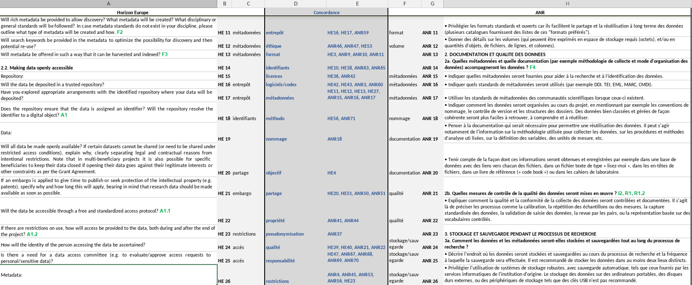
```
]

À retrouver sur : https://github.com/carenes/urfist_bdx_DMP/blob/master/materiel/dmp_HE_ANR.xlsx 

---

class: middle

# Codes et logiciels : plans de gestion des données

* **Modèles :**
  * PRESOFT projet: Plan de Gestion de Logiciel de la Recherche (Projet PRESOFT) https://dmp.opidor.fr/template_export/1241559633.pdf
  * Software Sustainability Institut: SSI Software Management Plan - Minimal Software Management Plan https://dmp.opidor.fr/template_export/4910541.pdf

* **Principes FAIR pour les codes et logiciels :**
  * Lamprecht, Anna-Lena, LeylaGarcia, MateuszKuzak, Carlos Martinez, Ricardo Arcila, Eva Martin Del Pico, Victoria DominguezDel Angel, et al. «TowardsFAIR Principlesfor ResearchSoftware». Data Science3, no1 (1 janvier 2020): 37-59. https://doi.org/10.3233/DS-190026.

---

# Différents modèles de PGD

Consulter les [modèles](https://dmp.opidor.fr/public_templates) sur DMP OPIDoR

* **Financements européens :** 
  * Horizon Europe, (H2020)
  * ERC
* **Financeurs français :** 
  * ANR
  * INCa
* **Etablissements :** 
  * Institut Pasteur
  * CEA
  * INRAE
  * Université de Strasbourg
* **Disciplinaires (unités, consortium, projets)**
  * ICM
  * MASA
  * PRESOFT project
  * PRODIG UMR


---

class: middle
background-color: #bebebe

# Comparez les modèles de PGD

## Exercice

*Sur le site DMP OPIDoR, choisissez deux [modèles](https://dmp.opidor.fr/public_templates) de PGD et observez leurs différences. Lesquels vous paraissent aisés à utiliser, pourquoi ? Certains vous semblent-ils particulièrement complexes, pourquoi ?*


---

class: center, inverse, middle

# 2. Plans de gestion des données : des évolutions à prévoir


---

class: middle

# En LaTeX et en Rmd

* Deux modèles en cours d’adaptation : 
  * Un modèle adapté de celui de l’ANR
  * Un modèle adapté de celui de H2020
* [Work in progress](https://github.com/carenes/DMP_templates)…


---

class: middle

# Les MaDMP 

* Vers des **DMP actionnables par des machines**
* Exemple d’[Argos](https://argos.openaire.eu/) d’OpenAIRE : outil d’aide à la rédaction de MaDMP
* Un MaDMP en préparation pour DMP OPIDoR
* Voir les travaux du groupe RDA : [DMP Common Standards WG](https://www.rd-alliance.org/group/dmp-common-standards-wg/outcomes/rda-dmp-common-standard-machine-actionable-data-management)


---

background-color: #bebebe
class: middle

# Démonstration d'un MaDMP : ARGOS

https://argos.openaire.eu/

---

class: center, inverse, middle

# 3. Les data papers


---

# Le data paper : objectif

### Quoi ?
* Article décrivant un jeu de données, notamment les méthodes de recueil
* Détaille les potentiels de réutilisation de données
* Les articles font l’objet d’un peer-reviewing

### Comment ? 
* Le PGD peut servir de trame
* Il peut être publié dans une revue académique classique, plus souvent publié dans un data journal

###  Pourquoi ?
*  Informer la communauté scientifique de la disponibilité de ces jeux de données et de leur potentiel pour des utilisations futures
* Montrer l’originalité et la portée du jeu de données décrit

---

# Le data paper : trame

La particularité du texte d’un data paper porte sur la description fine à la fois de la méthode de production des données et des données elles-mêmes, ainsi que sur l’absence de résultat et discussion : 
* **contexte** de la recherche et travaux antérieurs dans lesquels celle-ci s’inscrit, apport des données dans ce contexte et potentiel de réutilisation ;
* **protocole** de production des données : qualification du producteur des données, méthode de constitution de l’échantillon, matériel utilisé, procédures de traitement, mise en œuvre du contrôle qualité sur les données, questions éthiques soulevées par la collecte de ces données (consentement de 
patients), etc.
* **description** du jeu de données : nature ou type de données, format ainsi que version du format le cas échéant, volume de données, date de publication des données dans l’entrepôt choisi par l’auteur ou préconisé par l’éditeur, identifiant des données (attribué par l’entrepôt), lien pérenne versl’entrepôt choisi, licence d’utilisation attribuée aux données.
L’article regroupe donc un texte spécifique à la description des données, ainsi qu’un lien vers le jeu de données décrit, dans l’entrepôt où celui-ci a été déposé.

&nbsp;

<small>Source : Reymonet, Nathalie. 2017. « Améliorer l’exposition des données de la recherche : la publication de data papers » https://archivesic.ccsd.cnrs.fr/sic_01427978/document.</small>


---

class: middle
background-color: #bebebe

# Deux exemples de data papers

* Leach TH, Winslow LA, Acker FW, Bloomfield JA, Boylen CW, Bukaveckas PA, et al. Long-term dataset on aquatic responses to concurrent climate change and recovery from acidification. Scientific Data [Internet]. 2018 [cité 28 mars 2019];5. Disponible sur: https://www.nature.com/articles/sdata201859
* Susini, Vanessa, Laura Caponi, Veronica Lucia Rossi, Antonio Sanesi, Nadia Romiti, Aldo Paolicchi, et Maria Franzini. « Data about Performances of Whole and Monovalent Half-Fragments Antibodies in Immunosorbent Assays ». Data in Brief 35 (avril 2021): 106778. https://doi.org/10.1016/j.dib.2021.106778. 


---

class: middle

# Quelques exemples de data journals

* [Biomedical Data Journal](http://biomed-data.eu/) (Biomédical)
* [Journal of Open Health Data](https://openhealthdata.metajnl.com/) (Données de santé)
* [Gigascience](https://academic.oup.com/gigascience) (Sciences de la vie)
* [Scientific Data](https://www.nature.com/sdata/) (Multidisciplinaire)
* [Data in Brief](https://www.journals.elsevier.com/data-in-brief/) (Multidisciplinaire)

### Voir aussi : 
* CIRAD. Rédiger et publier un data paper dans une revue scientifique. https://coop-ist.cirad.fr/gerer-des-donnees/rediger-un-data-paper/1-qu-est-ce-qu-un-data-paper
* DORANUM. Data papers et data journals : fiche synthétique. https://doranum.fr/data-paper-data-journal/fiche-synthetique/ 


---


class: center, inverse, middle

# 4. Vos retours d'expérience sur les PGD

---

class: center, inverse, middle

# 5. Le PGD : guide de rédaction


---

class: center, middle

# Quelques conseils de rédaction à partir des questions les plus fréquemment posées


---

class: center, middle
background-color: #7a6666

# Collecte

---

class: middle

# Conditions de productions - 1 

Pour produire, collecter ou analyser vos données quels logiciels utilisez-vous ? 
* Traitement de texte (Ex: Word) 
* Editeur de texte brut (Ex : Notepad++) 
* Tableur (Ex: Excel) q Logiciel d’analyse statistique (Ex: SPSS) 
* Logiciel d’analyse de données qualitatives (Ex: NVIVO) 
* Code informatique (Ex : R, Python) 
* Traitement d’image, de sons, de vidéos 
* Cartographie et géomatique 
* Autre ?

&nbsp;

<small>Source : Saby, Mathieu. 2019. « Formation Organiser, Documenter et Gérer Ses Données Au Quotidien (2019) », mai. https://osf.io/d3xy4/.</small>

---

class: middle

# Conditions de production - 2

**Checklist pour vous et vos potentiels réutilisateurs**

* Fonctionnent-ils en ligne ou après installation sur un ordinateur ? 
* Fonctionnent-ils avec un système d’exploitation particulier (Windows, Mac, Linux) ? 
* Sont-ils liés à un type d’ordinateur ou à un instrument particulier (ex : microscope) ? 
* Sont-ils gratuits ou payants ? Qui paye ?
* S’ils n’existaient plus ou si vous n’y avez plus accès, pourriez-vous continuer à travailler ?

&nbsp;

<small>Source : Saby, Mathieu. 2019. « Formation Organiser, Documenter et Gérer Ses Données Au Quotidien (2019) », mai. https://osf.io/d3xy4/.</small>

---

class: center, middle
background-color: #7a6666

# Description et documentation

---

class: middle

# Documenter ses données

Le contenu minimal de la documentation d'un jeu de données devrait comprendre : 
* description du projet de recherche
* objectifs du projet
* hypothèses
* informations détaillées sur la collecte de données
* procédures employées pour le nettoyage et le traitement des données
* logiciels utilisés, versions, systèmes d'exploitation
* descriptif de la structuration des données et relations les unes avec les autres
* informations sur les différentes versions (git est votre ami !)
* modalités d'accès et de réutilisation

&nbsp;

Ces informations figureront dans le PGD, mais il est indispensable de les documenter en amont pour avoir de bonnes pratiques de gestion. 

---

# Documenter ses données

**Un guide** : 
* Arnould, Pierre-Yves, et Marie-Christine Jacquemot-Perbal. 2017. 
« Guide de bonnes pratiques: gestion et valorisation des données de recherche ». OTELO.
https://ordar.otelo.univ-lorraine.fr/record?id=10.24396/ORDAR-1 

.center[
```{r echo=FALSE, out.height=250, out.width=200}
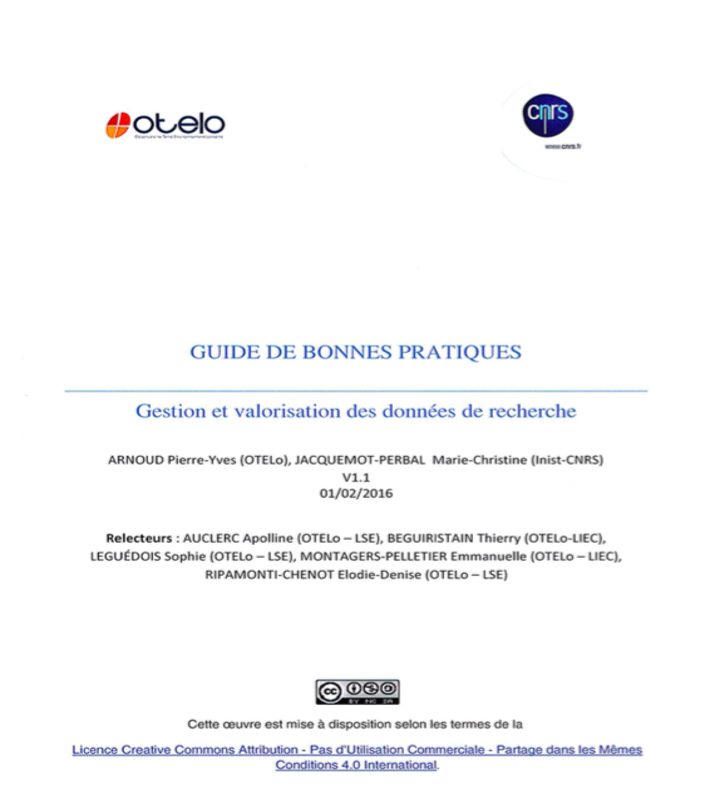
```
]

**Créer des dictionnaires de données**
* « Data Dictionaries ». https://www.usgs.gov/products/data-and-tools/data-management/data-dictionaries


---

class: middle

# Documenter ses données : outils

## Deux exemples

[Open Science Framework](https://osf.io/)
* Wiki: documenter son projet, etc
* Collaborators: ajouts de collaborateurs, rôles différencier
* Composants : possiblité d'organiser l'espace en sous projets
* Contrôle de version: upload files of the same name & OSF will trackyour versions!
* DOI !

&nbsp;

[Jupyter Notebooks](https://jupyter.org/try)
* Éditeur de code
* Carnet de recherche


---

# Formats de fichiers

* Lorsque c'est possible, privilégier les formats ouverts. 
* Si un format propriétaire est utilisé par toute la communauté disciplinaire, conservez-le et précisez-le dans le DMP.

| Format de fichier déconseillé | Format privilégié |
| --- | --- |
| Excel (.xls, .xlsx) | Comma separated values (.csv) |
| Word (.doc, .docx) | Texte ascii (.txt) ou PDF/A si formatage |
| Powerpoint (.pptx) | PDF/A (.pdf) |
| Photoshop (.psd) | TIFF (.tif, .tiff) | 
| Quicktime (.mov) | MPEG-4 (.mp4) |

&nbsp;

<small>Voir : Rivet, Alain, Marie-Laure Bachèlerie, Auriane Denis-Meyere, et Delphine Tisserand. 2018. « Traçabilité des activités de recherche et gestion des connaissances : Guide pratique de mise en place ». http://qualite-en-recherche.cnrs.fr/IMG/pdf/guide_tracabilite_activites_recherche_gestion_connaissances.pdf</small>


---

# Nommage des fichiers

.pull-left[
#### Classement thématique 
* par sujet : 
  - sujet_type_date_version.extension
  - reunion_CR_20200227_V01.docx
* par typologie de document :
  - type_sujet_date_version.extension
  - CR_reunion_20200227_V01.docx

#### Classement chronologique
* par sujet : 
  - date_sujet_type_version.extension
  - 20200227_reunion_CR_V0.1.docx
* par type de document :
  - date_type_sujet_version.extension
  - 20200227_CR_reunion_V0.1.docx
]
  
.pull-right[
#### Principes
* Pas plus de 32 caractères, moins si possible
* Pas d'espaces, pas de caractères spéciaux

&nbsp;
  
<small>Voir : AAF, Section Archives communales et intercommunales. 2014. « Fiche pratique n°2 Nommer les dossiers et fichiers numériques ». http://archives.hautesavoie.fr/download.cgi?filename=accounts/mnesys_cg74/datas/cms/fp2_nommage.pdf.</small>
]


---

# Un exemple d’organisation de jeux de données de projet

.pull-left[
Colomb, Julien, Thorsten Arendt, Deepti Mittal, et Keisuke Sehara. 2020. « Folder Structure Template for Research Repositories ». https://doi.org/10.5281/zenodo.4410128 
]

.pull-right[
```{r echo=FALSE, out.height=800, out.width=200}
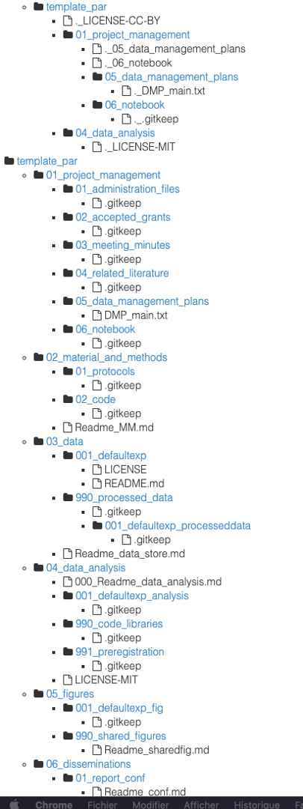
```
]


---

class: middle
background-color: #bebebe

# Description et collecte, organisation et nommage : quelques exemples

* Cavalier, Jean-François. “LipInTB Plan de Gestion de Données,” 2019. https://dmp.opidor.fr/plans/4624/export.pdf p. 3 
* Lumley, Emily. “CompBioMed D3.1_Data Management Plan_v1.0,” 2020, 12. https://www.compbiomed.eu/wp-content/uploads/2017/03/D1.3_DataManagementPlan_CBK_v1.3.pdf p. 6-7
* Aventurier, Pascal. « Bridge Research through Interoperable Data Governance and Environments : data management plan », 2020. https://dmp.opidor.fr/plans/5954/export.pdf p. 3-5
* Doran, Michelle. “D1.2 ORDP: KPLEX - Open Research Data Pilot – 2018-01-31.” Research Report. Trinity College Dublin, March 2018. https://hal.archives-ouvertes.fr/hal-01842371. p. 6-8


---

# Documentation et qualité

Des données non documentées ne sont pas réutilisables...

.center[
```{r echo=FALSE, out.height=400, out.width=700}
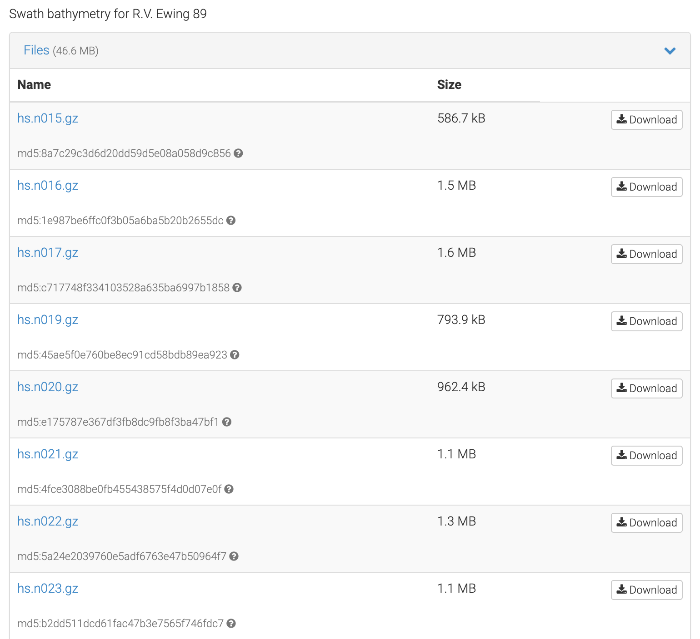
```
]

---

class: middle

# Métadonnées - 1

* Informations permettant de décrire les données
* Métadonnées embarquées dans certains documents : par exemple un article de recherche
* Métadonnées externes la plupart du temps pour les données : par exemple un fichier de métadonnées en xml ou un fichier Readme

&nbsp;

<small>Source : Ancelin-Fabre, Justine. 2021. « Rédiger un plan de gestion pour ses données de recherche ». https://urfist.chartes.psl.eu/sites/default/files/docs/20210601_ancelin-fabre_pgd.pdf.</small>


---

class: middle

# Métadonnées - 2

* Un standard générique, le dublin core : 15 champs
  * parfois associé à des standards disciplinaires : DDI (SHS), EML (écologie), DwC (Darwin Core, biodiversité), EAD (archives)
  * souvent **transparent lors du dépôt**, champs à remplir sur les formulaires des entrepôts.

* Répertoire de standards disciplinaires : 
  * DCC. Disciplinary metadata. http://www.dcc.ac.uk/resources/metadata-standards 
  * RDA Metadata Directory
http://rd-alliance.github.io/metadata-directory/
  
* Générer ses propres métadonnées : https://doranum.fr/wp-content/uploads/datacite_metadata_generator_4.0.html 


---

class: middle

# Plusieurs niveaux de standards 

**Standards syntaxiques** : 
* encodage des valeurs (ex.: XML) 

**Standards sémantiques** : 
* valeurs des champs de métadonnées (ex.: référentiels techniques...) 

**Standards de métadonnées** : 
* vocabulaires de description organisant les intitulés des champs de métadonnées (ex.: DublinCore, EAD...)

&nbsp;

<small>Source : Ancelin-Fabre, Justine. 2021. « Ré
diger un plan de gestion pour ses données de recherche ». https://urfist.chartes.psl.eu/sites/default/files/docs/20210601_ancelin-fabre_pgd.pdf.</small>


---

# Métadonnées pour les codes et logiciels 

* Projet [CodeMeta](https://codemeta.github.io/create/)
  * Fichier de métadonnées en json 
  * Un [générateur](https://codemeta.github.io/codemeta-generator/) en ligne

```{r echo=FALSE, out.height=400, out.width=800}
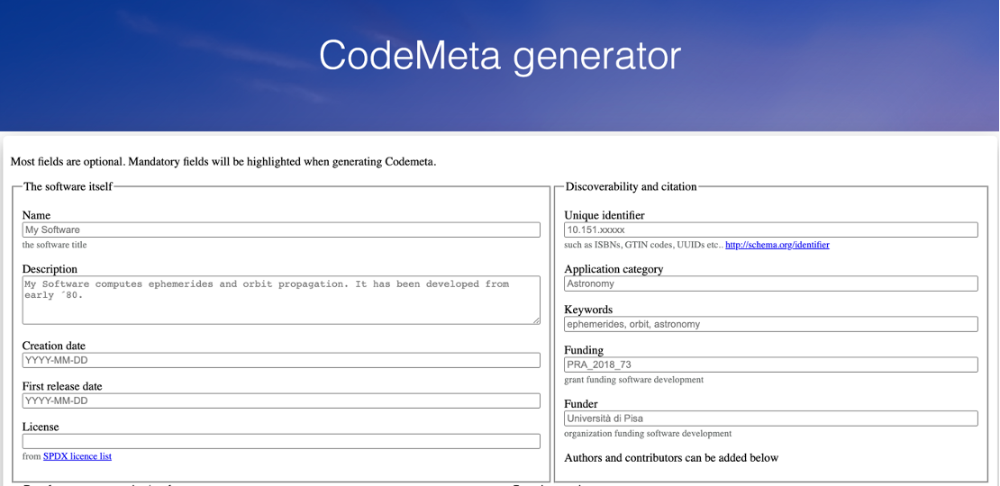
```


---

class: middle
background-color: #bebebe

# Métadonnées - exemple

[Créer un fichier de métadonnées](https://nsteffel.github.io/dublin_core_generator/generator.html) simple en Dublin Core

---

class: middle

# Mots-clés, vocabulaires

* Indispensable pour décrire le jeu de données et augmenter sa visibilité dans les moteurs de recherche
  * Exemples : Agrovoc (agriculture), CIDOC CRM (patrimoine culturel), AsCoPain-T (agriculture), SNOMED (biomédical), etc.

* Rechercher des vocabulaires : 
  * BARTOC https://bartoc.org/ 
  * FAIRsharing : https://fairsharing.org/standards/ 


```{r echo=FALSE, out.height=100, out.width=600}

```


---

# Fichiers Readme

* Documenter le dépôt
  * présente les règles de nommage et d'organisation du jeu de données, 
décrit le contenu 
  * précise les logiciels ou codes informatiques nécessaires pour l’utilisation

* Trames de fichiers Readme :
  * 4TU. Guidelines for creating a README file. https://researchdata.4tu.nl/fileadmin/user_upload/Documenten/Guidelines_for_creating_a_README_file.pdf 
  * Doranum. Gabarit « Readme ». https://doranum.fr/wp-content/uploads/gabarit_readme.txt 
  * Kozlowski, Wendy. s. d. « Guidelines for Writing “Readme” Style Metadata » https://data.research.cornell.edu/sites/default/files/SciMD_ReadMe_Guidelines_v4_1_0.pdf 

&nbsp;

Gallagher, Sean. 2019. « Researchers find bug in Python script may have affected hundreds of studies ». Ars Technica. 15 octobre 2019. https://arstechnica.com/information-technology/2019/10/chemists-discover-cross-platform-python-scripts-not-so-cross-platform/.

---

class: middle

# Et le cahier de labo ? 

* Le cahier de labo est mentionné dans la plupart des modèles de PGD, dont celui de l’ANR.
* Il n'est pas à partager, mais doit rester accessible.

* **A conserver !**
  * AAF. 2012. « Référentiel de gestion des archives de la recherche »https://www.archivistes.org/IMG/pdf/referentiel_recherche_intro_septembre2012_corrige_.pdf 


---

class: middle

# Le contrôle qualité

.pull-left[
* Garantir la traçabilité
* Un guide : 
  * Rivet, Alain, Marie-Laure Bachèlerie, Auriane Denis-Meyere, et Delphine Tisserand. 2018. 
[« Traçabilité des activités de recherche et gestion des connaissances : Guide pratique de mise en place »](http://qualite-en-recherche.cnrs.fr/IMG/pdf/guide_tracabilite_activites_recherche_gestion_connaissances.pdf).
]

.pull-right[
```{r echo=FALSE, out.height=350, out.width=250}
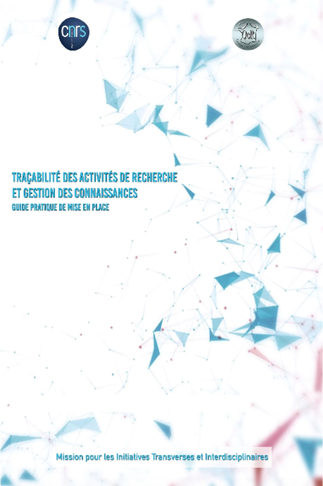
```
]

---

class: center, middle
background-color: #7a6666

# Stockage

---

# Stocker pendant le projet 

* Conserver plusieurs copies de ses données sur différents lieux de stockage. 
* Règle de la **sauvegarde 3-2-1 : 3 copies sur 2 supports différents, avec au moins 1 une copie à distance**
* Privilégier des systèmes de stockage robustes, avec **sauvegarde automatique**, tels que ceux fournis par les services informatiques de l’institution d’origine
* Gérer les accès aux données : **accès sécurisés** pour les partenaires, vérification des accès en fin de projet ou en cas de départ d’une personne
* **Chiffrer** les données si elles ont un caractère sensible
* Utiliser un **cloud sécurisé** pour les accès distants

.center[
```{r echo=FALSE, out.height=250, out.width=450}
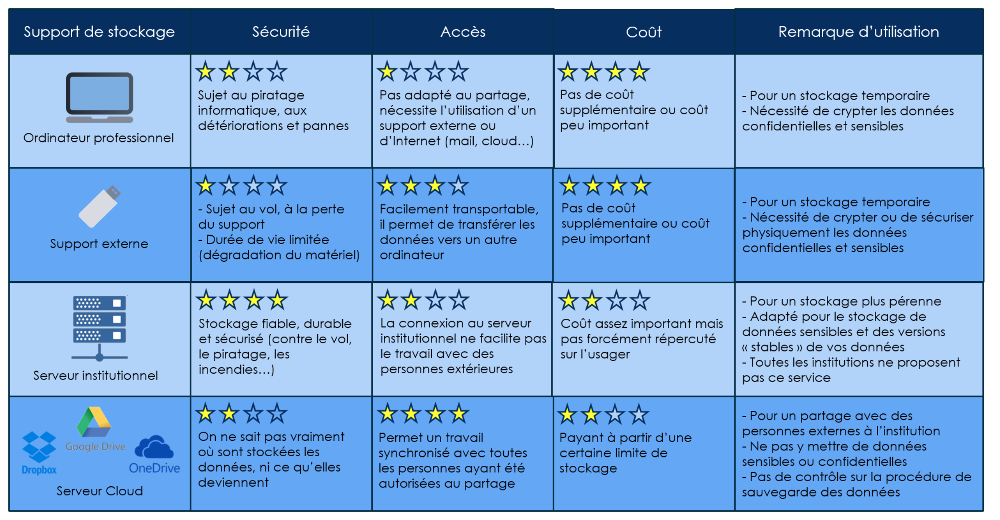
```
]

---

class: middle
background-color: #bebebe

# Sécurité et sauvegarde : un exemple 

Brau, Frédéric. « Base de données d’images en sciences de la vie d’Université Côte d’Azur : data management plan », 2020. 
http://unice.fr/plateformes/mica/ressources/base-de-donnees-omero-1/Base_de_donnes_dimages_en_sciences_de_la_vie_dUniversit_Cte_dAzur.pdf.


---

class: center, middle
background-color: #7a6666

# Données personnelles, données sensibles, éthique


---

class: middle

# Anticiper les risques - 1

## Recueil de données sensibles

**Description du risque : décrire les données sensibles collectées**

* Données personnelles 
* Données de patients 
* Données biologiques

**Gestion du risque : identifier les personnes qui vont vous aider à gérer les données sensibles**

* Protection renforcée 
  * Autorisation d'accès 
  * Sécurité renforcée du stockage des données 
* Diffusion des données 
  * Anonymisation réversible ou irréversible 
  * Pseudonymisation 
  * Limitation de la réutilisation à certains usages 
  * Demande d'autorisation d'accès

<small>Source : Puren, Marie. 2021. « Créer son plan de gestion des données ». École thématique. Lille, France: MESH, Lille. https://hal.archives-ouvertes.fr/hal-03183724.</small>


---

# Anticiper les risques - 2

## Gestion des données 

**Description du risque** 

* Difficultés pour collecter des données sensibles (autorisations à obtenir)
* Délais pour collecter des données sensibles 
* Difficultés à gérer l'échange de données entre partenaires 
* Difficultés de curation : du nettoyage des données à leur stockage 

**Gestion du risque : identifier les personnes qui vont pouvoir vous aider à gérer ces risques**

* Décrire les démarches à effectuer pour obtenir des autorisations 
* Evaluer les délais 
* Mettre en place un protocole d'échange détaillé en collaboration avec les partenaires *
* Envisager toutes les difficultés éventuelles dans la curation des données avec les services supports

<small>Source : Puren, Marie. 2021. « Créer son plan de gestion des données ». École thématique. Lille, France: MESH, Lille. https://hal.archives-ouvertes.fr/hal-03183724.</small>


---

class: middle

# Le RGPD : bases légales

Il est permis de traiter des données personnelles lorsque le traitement repose sur une des 6 bases légales mentionnées à l’article 6 du RGPD :  

* le **consentement** : la personne a consenti au traitement de ses données ;
* le contrat : le traitement est nécessaire à l’exécution ou à la préparation d’un contrat avec la personne concernée ;
* l’obligation légale : le traitement est imposé par des textes légaux ;
* la **mission d’intérêt public** : le traitement est nécessaire à l’exécution d’une mission d’intérêt public ;
* l’intérêt légitime : le traitement est nécessaire à la poursuite d’intérêts légitimes de l’organisme qui traite les données ou d’un tiers, dans le strict respect des droits et intérêts des personnes dont les données sont traitées ;
* la sauvegarde des intérêts vitaux : le traitement est nécessaire à la sauvegarde des intérêts vitaux de la personne concernée, ou d’un tiers.

&nbsp;

<small>Source : CNIL. « La licéité du traitement : l’essentiel sur les bases légales prévues par le RGPD ». Consulté le 3 octobre 2021. https://www.cnil.fr/fr/les-bases-legales/liceite-essentiel-sur-les-bases-legales.
</small>

---

class: middle

# Principes du RGPD

Les 5 grands principes des règles de protection des données personnelles sont les suivants :
* Le principe de **finalité** : le responsable d'un fichier ne peut enregistrer et utiliser des informations sur des personnes physiques que dans un but bien précis, légal et légitime ;
* Le principe de **proportionnalité et de pertinence** : les informations enregistrées doivent être pertinentes et strictement nécessaires au regard de la finalité du fichier ;
* Le principe d'une **durée de conservation limitée** : il n'est pas possible de conserver des informations sur des personnes physiques dans un fichier pour une durée indéfinie. Une durée de conservation précise doit être fixée, en fonction du type d'information enregistrée et de la finalité du fichier ;
* Le principe de **sécurité et de confidentialité** : le responsable du fichier doit garantir la sécurité et la confidentialité des informations qu'il détient. Il doit en particulier veiller à ce que seules les personnes autorisées aient accès à ces informations ;
* Les **droits des personnes**

&nbsp;

<small>Source : CNIL. « Quels sont les grands principes des règles de protection des données personnelles ? ». Consulté le 3 octobre 2021. https://www.cnil.fr/fr/cnil-direct/question/quels-sont-les-grands-principes-des-regles-de-protection-des-donnees.
</small>

---

class: middle

# Travailler avec son délégué à la protection des données

* Fonction obligatoire : une personne nommée par établissement
* Les "**traitements**" de données personnelles sont à déclarer
* Le détenteur de données personnelles doit remplir une **fiche de registre d'activité** :
  * Nom des responsables du traitement
  * Coordonnées du sous-traitant (si nécessaire)
  * **Population concernée**
  * **Finalité** de traitement
  * Énumération des tâches effectuées pour le traitement
  * Informations communiquées aux personnes concernées
  * Échanges de données (si nécessaire)

&nbsp;

<small>Source : DoRANum. « RGPD – Protection des données personnelles et RGPD dans la recherche : conséquences, obligations, implications ». Consulté le 3 octobre 2021. https://doranum.fr/aspects-juridiques-ethiques/protection-des-donnees-personnelles-et-rgpd-dans-la-recherche-consequences-obligations-implications/.</small>

---

class: middle

# Guides sur le RGPD

* Université Paris Lumières. 2019. « Fiches pratiques sur le Règlement Général pour la Protection des Données ». https://www.parisnanterre.fr/dpd-guide-rgpd-943295.kjsp?RH=1557908685504
* **Sciences humaines**
  * InSHS. 2021. « Les sciences humaines et sociales et la protection des données à caractère personnel dans le contexte de la science ouverte : guide pour la recherche - v2 ». Exemples de fiches p. 30 & sq. https://www.inshs.cnrs.fr/sites/institut_inshs/files/pdf/Guide_rgpd_2021.pdf
* **Santé**
  * CNIL. 2018. « Recherche médicale : quel est le cadre légal ? » 2018. https://www.cnil.fr/en/node/24981 


---

# Anonymiser ou pseudonymiser - 1

Deux procédures différentes :
* 👻   **Anonymisation** : il devient impossible de réidentifier les personnes (et on sort du cadre du RGPD), la procédure est irréversible.
* 👾   **Pseudonymisation** : on utlise des données des données indirectement identifiantes (alias, numéro séquentiel, etc.).

.center[
```{r echo=FALSE, out.height=250, out.width=700}
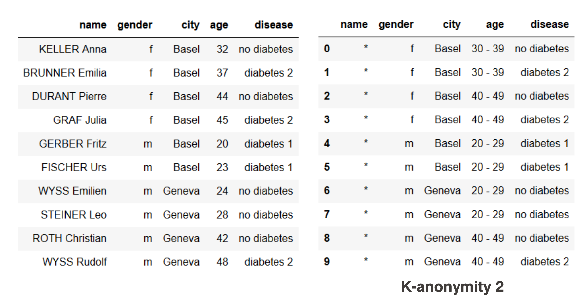
```
]

<small>Source : Blumer, Eliane, Samath, Sitthida, Varrato, Francesco, & Borel, Alain. (2020, April 28). Optimizing your research data management. Zenodo. https://doi.org/10.5281/zenodo.3773657</small>

---

class: middle

# Anonymiser ou pseudonymiser - 2

Deux outils, non testés, pour anonymiser : 
* ARX https://arx.deidentifier.org/ 
* Amnesia https://amnesia.openaire.eu/ 

```{r echo=FALSE, out.height=50, out.width=150}

```

<small>Source : « L’anonymisation de données personnelles | CNIL ». s. d. Consulté le 26 septembre 2021. https://www.cnil.fr/fr/lanonymisation-de-donnees-personnelles.</small>


---

class: middle

# Éthique

* **Codes d’éthique ou de déontologie de la discipline**
* En France, **« Charte nationale de déontologie des métiers de la recherche »**. 2015. https://cache.media.enseignementsup-recherche.gouv.fr/file/Enseignement_superieur/47/6/charte_nationale_deontologie_metiers_de_la_R_915476.pdf 
Signée par le CNRS, l’INSERM et la CPU
* En Europe, ALLEA. 2017. **« The European Code of Conduct for Research Integrity »**. 2017. https://allea.org/wp-content/uploads/2017/05/ALLEA-European-Code-of-Conduct-for-Research-Integrity-2017.pdf 


---

class: center, middle
background-color: #7a6666

# Partage et archivage

---

# Ouvrir ses données ou non ? 

.pull-left[
```{r echo=FALSE, out.height=400, out.width=250}
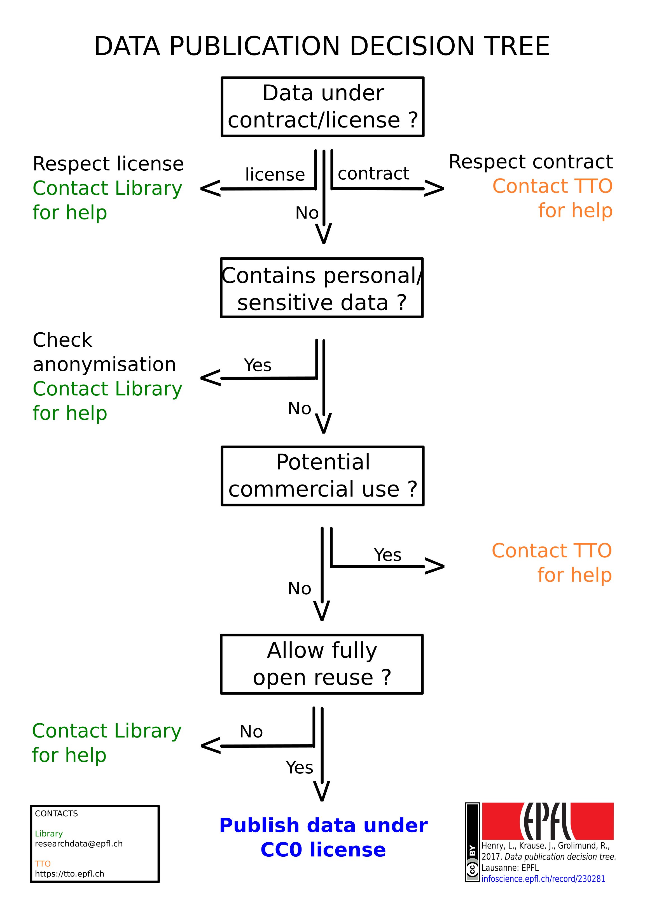
```
]

.pull-right[
* Penser à la potentielle valorisation des données
* Valorisation et ouverture ne sont pas nécessairement incompatibles
* *TTO : bureau du transfert de technologie*

&nbsp;

<small>Source : Data publication decision tree. 2017. https://infoscience.epfl.ch/record/230281.</small>
]

---

# Ouvrir les données : les licences ouvertes

.pull-left[
* **Œuvres** : 
  * [Creative Commons](https://creativecommons.org/licenses/?lang=fr-FR)
  * [Licence ouverte française](https://www.etalab.gouv.fr/licence-ouverte-open-licence), dite Etalab

* **Logiciels et bases de données**
  * Bases de données : [Licences de l’Open Knowledge Foundation](https://opendatacommons.org/licenses/index.html), PDDL, ODC-By, ODC-ODbL 
  * Logiciels : licences [GNU](https://www.gnu.org/licenses/license-list.html)

* **Un outil pour trouver une licence publique** :
https://ufal.github.io/public-license-selector/ 
]

.pull-right[
```{r echo=FALSE, out.height=250, out.width=350}
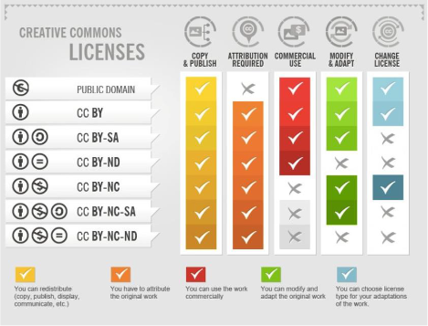
```
]

&nbsp;

<small>Source : FOSTER. Introduction to RDM concepts and tools / S. Venkataraman. 2018. https://www.fosteropenscience.eu/node/2514</small> 


---

class: middle

# Rechercher des entrepôts de données

* Trouver des entrepôts par disciplines :
  * [re3data](https://www.re3data.org/)
  * [fairsharing](https://fairsharing.org/)
  * [Liste d'entrepôts recommandée par Nature](https://www.nature.com/sdata/policies/repositories)
* Entrepôts français : 
  * [CAT OPIDoR](https://cat.opidor.fr/index.php/Entrep%C3%B4t_de_donn%C3%A9es)
* Rechercher des jeux de données
  * [Search DataCite](https://search.datacite.org/)
  * [OpenAIRE](https://explore.openaire.eu/)


---

class: middle

# Où partager ses données ?

* Entrepôt pluridisciplinaire (UE / CERN) : [Zenodo](https://zenodo.org/)
* Entrepôts privés : [Figshare](https://figshare.com/), [GigaDB](GigaDB), [Mendeley data](https://data.mendeley.com/)
* Entrepôts disciplinaires : [DRYAD](https://datadryad.org/stash), [Nakala](https://nakala.fr/), [Gbif](https://www.gbif.org/fr/)
* Entrepôts d’établissements : [data INRAE](https://data.inrae.fr/) 


---

class: middle

# Quand partager ?

* Sur le plan juridique, notion de **données achevées**
* Dans les guidelines européens
  * notion de **"early sharing"**
  * partage des données concomittant à la publication
* Pour la **thèse**, si volonté de partager
  * après la soutenance
  * après la publication d'articles


---

class: middle

# Préparer son dépôt

.center[
```{r echo=FALSE, out.height=400, out.width=400}
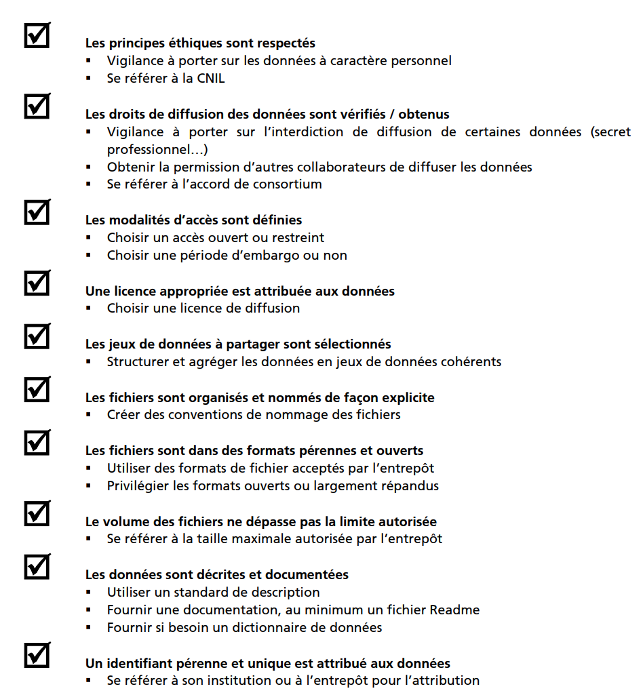
```
]

<small>Source : Doranum. Checklist avant de déposer ses données.https://doranum.fr/wp-content/uploads/FS_Checklist.pdf</small>

---

background-color: #bebebe
class: middle

# Déposer un jeu de données fictif

Utilisez les versions de test des entrepôts Zenodo ou Dataverse
* https://sandbox.zenodo.org/
* https://demo.dataverse.org/

&nbsp;

Si vous n'avez pas de fichier test, utilisez le fichier suivant : https://github.com/carenes/urfist_bdx_DMP/blob/master/materiel/rongeurs.xlsx (Source : Saby, Mathieu. 2019. « Formation Organiser, Documenter et Gérer Ses Données Au Quotidien (2019) » https://osf.io/d3xy4/)


---

class: middle

# Codes et logiciels : partage et archivage

* Plateformes de développement collaboratif, “**forges logicielles**” : 
  * GitHub, GitLab.com, BitBucket, instances de GitLab institutionnelles, etc.
  * Finalité : développer un logiciel de façon collaborative
  * Risques : **aucune garantie de pérennité** (nombreux exemples de fermetures brutales : Gitorious.org, Google Code, Bitbucket)
  * Ne remplacent pas un archivage pérenne !

* **Archives** :
  * [Software Heritage](https://www.softwareheritage.org/?lang=fr)
* Finalité : garantir une conservation et un accès pérennes
* Enjeux : **garantir l’accès et la possibilité d’utiliser des codes et des logiciels de manière pérenne**
* Constituer un **patrimoine informatique** 

---

class: middle
background-color: #bebebe

# Partage : un exemple

Aventurier, Pascal. « Bridge Research through Interoperable Data Governance and Environments : data management plan », 2020. https://dmp.opidor.fr/plans/5954/export.pdf p.7


---

class: middle

# Archiver ses données

* **Dès le début du projet :**
  * Adopter des conventions pour nommer les dossiers et les fichiers
  * Anticiper les éventuelles opérations d’anonymisation des données
* **Pendant le projet :**
  * Déterminer ce qui sera conservé ou non
  * Faire le point sur la durée de conservation
* **Après le projet :**
  * Procéder au tri des jeux produits
  * Prévoir l’archivage pérenne (intégrité et lisibilité des fichiers sur le long terme)
  
&nbsp;

<small>Un guide : Association des Archivistes de France. « **Référentiel de gestion des archives de la recherche** ». https://www.archivistes.org/IMG/pdf/referentiel_recherche_intro_septembre2012_corrige_.pdf</small> 


---

class: middle

# Que garder ? 


* Est-ce que les données doivent être gardées pour des **raisons légagles** et pour combien de **temps** ?
* Est-ce que les données doivent être conservées sans aucune **perte d'information** ? Quelle perte d'information pourrait rendre les données inutilisables ? 
* Quel est l'**intérêt** à conserver les données ?
* Font-elles partie d'une **collecte** plus importante ? 
* Pourront-elles être **de nouveau collectées** et, si oui, sans **coût** important ?
* Y a-t-il un **utilisation ultérieure** des données à prévoir ? De quel type ?
* Les données ont-elles une **valeur culturelle ou sociale** ?
* Les données ont-elles une **qualité suffisante** pour une utilisation ultérieure ?
* Les données peuvent-elles être utilisées à des fins d'**enseignement** ?

&nbsp;

<small>Vogel, Iris, et Marie Ryan (2020). s. d. « Workshop for Sustainable Research Data Management », https://www.fdm.uni-hamburg.de/service/schulungen-sprechstunde/data-managment-dmp.pdf.</small>

 
---

class: middle
background-color: #bebebe

# Archivage : un exemple 

Brau, Frédéric. « Base de données d’images en sciences de la vie d’Université Côte d’Azur : data management plan », 2020. P.5
http://unice.fr/plateformes/mica/ressources/base-de-donnees-omero-1/Base_de_donnes_dimages_en_sciences_de_la_vie_dUniversit_Cte_dAzur.pdf


---

class: middle

# Les identifiants pérennes 

* Le plus utilisé :
  * **DOI** : identifiant pérenne, qui permet de retrouver l'emplacement d'un document en ligne si son URL a changé.
  * Automatiquement généré lors du dépôt sur un entrepôt de données

* Un service de fourniture de DOI à l’INIST, le service [PID OPIDoR](https://opidor.fr/identifier/), à destination des structures : 
  * demander l’ouverture d’un compte auprès de DataCite ;
  * attribuer des DOI à partir de votre compte ;
  * bénéficier de services de contrôle et de traitement en nombre des DOI. 

* Autres identifiants pérennes :
  * **Handle system** : permet d’attribuer des identifiants pérennes à des objets numériques
  * **ARK** : identifiant pérenne pour des objets numériques et physiques, très utilisé par les bibliothèques. 


---

class: center, middle
background-color: #7a6666

# Responsabilités et coûts

---

class: middle

# Responsabilité de la gestion des données

* Le **responsable du DMP** : n'est pas forcément la responsable du projet, plus souvent l'ingénieur en charge de la production et du traitement des données.
* Le DMP est un **livrable**, qui **évolue** au fil du projet :
  * V1 attendue 6 mois après la contractualisation,
  * V2 à mi-projet,
  * Version supplémentaire à chaque étape importante (facultative),
  * V3 en fin de projet.

---

class:middle

# Coûts

* Outils et checklists pour chiffrer les coûts de stockage et d’archivage des données :
  * RDM costs. OpenAIRE. https://www.openaire.eu/how-to-comply-to-h2020-mandates-rdm-costs 
  * UK Data Service - Data management costing tool and checklist https://www.ukdataservice.ac.uk/media/622368/costingtool.pdf 
  * EPFL Library Cost Calculator for Data Management https://costcalc.epfl.ch/
  * Utrecht University Cost of data management https://www.uu.nl/en/research/research-data-management/guides/costs-of-data-management 
* Les coûts de gestion des données, qu'il s'agisse de ressources humaines ou matérielles, sont éligibles dans le cadre d'un financement de projet. 


---

class: middle

.pull-left[
# A qui s'adresser 
]

.pull-right[
```{r echo=FALSE, out.height=68, out.width=68}

```
]

* **Rédaction du DMP, partage des données** : bibliothécaires, professionnels IST. Répertoire [SOS PGD](https://scienceouverte.couperin.org/sos-pgd/)
* **Exigences du financeur, coûts éligibles, valorisation** : direction de la recherche
* **Données personnelles** : DPD
* **Questions juridiques** : services des affaires juridiques
* **Éthique** : référent de l'établissement, en santé comités de protection des personnes (recherche biomédicale notamment)
* **Protection du potentiel scientifique et technique et de l’innovation** : SATT
* **Informatique** : DSI
* **Sécurité, défense** : RSSI, fonctionnaire de sécurité de défense
* **Archivage pérenne** : archivistes

---

class: middle

# Evaluer ses PGD

* Ancelin-Fabre, Justine. « Grille_evaluation_H2020_fr.docx ». https://drive.google.com/file/d/17kjkq-OEwBre2Z8U7fvwILzlGbaGmlwf/view?usp=sharing&usp=embed_facebook.
* Ancelin-Fabre, Justine. « Grille_relecture_PGD_ANR.docx ». https://drive.google.com/file/d/1A7LHW_y1vHmbHxYmmjECpKgmOsicjA01/view?usp=sharing&usp=embed_facebook.
* Doranum. « Grille de relecture de PGD - Modèle ANR ». https://doranum.fr/wp-content/uploads/Grille-relecture-PGD-Modele-ANR-V3.pdf

---

class: middle
background-color: #bebebe

# Quelques exemples de PGD - 1

## Trouver des PGD publics 
* Sur DMP OPIDoR : https://dmp.opidor.fr/public_plans 
* DMP Online : https://dmponline.dcc.ac.uk/public_plans 
* Sur Zenodo, en recherchant Data management plan

---

background-color: #bebebe

# Quelques exemples de PGD - 2

* Un PGD publié sous forme d’article de revue (PhD) https://riojournal.com/articles.php?id=10600
* Un PGD rédigé dans un tableau https://www.dcc.ac.uk/sites/default/files/documents/resource/DMP/0185_130901_David-Cooper_Trevor-Jones_DMP_Application-Stage.pdf
* Un PGD très court (4 pages, v1, ERC) https://cordis.europa.eu/project/id/833438/fr 
* Un PGD très long intégrant figures et tableaux (30 pages, H2020) https://ec.europa.eu/futurium/sites/futurium/files/d1.3_692819_data_management_plan_v1.pdf
* Un PGD encore plus long (54 pages ! H2020), avec des annexes http://www.drive2thefuture.eu/wp-content/uploads/2019/11/D9.4_Data-Management-Plan.pdf 
* Un PGD avec une stratégie de sauvegarde très détaillée (PhD) https://www.wur.nl/upload_mm/4/a/9/ff641753-3b34-44c6-a82e-d6df6b02959d_Data_Management_Plan_Beatrice_Ramirez_Wordconversion.pdf 
* Un PGD qui met l’accent sur les aspects éthiques et juridiques (H2020) https://inspiresproject.com/wp-content/uploads/2018/03/D8.1_v02_FINAL-VERSION.pdf

&nbsp;

<small>Source : Ancelin-Fabre, Justine. 2021. « Rédiger un plan de gestion pour ses données de recherche ». https://urfist.chartes.psl.eu/sites/default/files/docs/20210601_ancelin-fabre_pgd.pdf.</small>

---

class: middle
background-color: #bebebe

# Exercice : auto-évaluer un PGD

*Choisissez un PGD dans les listes ci-dessus, présentez-le au groupe et relevez ses points forts et faibles à l'aide des grilles d'évaluation*

* Ancelin-Fabre, Justine. s. d. « Grille_evaluation_H2020_fr.docx ». Google Docs. Consulté le 20 janvier 2021a. https://drive.google.com/file/d/17kjkq-OEwBre2Z8U7fvwILzlGbaGmlwf/view?usp=sharing&usp=embed_facebook.
* Ancelin-Fabre, Justine. s. d. « Grille_relecture_PGD_ANR.docx ». Google Docs. Consulté le 20 janvier 2021b. https://drive.google.com/file/d/1A7LHW_y1vHmbHxYmmjECpKgmOsicjA01/view?usp=sharing&usp=embed_facebook.


---

class: center, inverse, middle

# 6. DMP OPIDoR, un outil d'aide à la rédaction


---

class: middle

# Pourquoi DMP OPIDoR ?

.pull-left[
* Développé et maintenu par l'INIST
* Gratuit
* Facilite le **travail collaboratif**
* Centralise **plusieurs modèles**
* Permet l'affichage de **recommandations**
* Propose une service d'**assistance** 
* Exporte des documents rédigés dans divers formats
]

.pull-right[
```{r echo=FALSE, out.height=200, out.width=600}
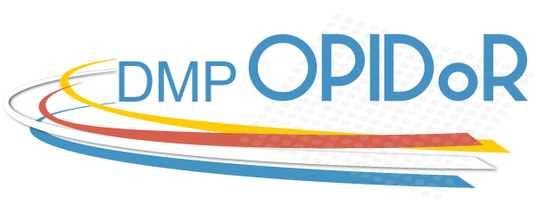
```
]


---

class: center, middle
background-color: #bebebe

# Prise en main de DMP OPIDoR
## Un peu de pratique !

<!-- voir support JAF, 71 & sq -->


---

class: center, middle
background-color: #bebebe

# Exercice de rédaction

Commencez à rédiger votre trame de PGD, en vous aidant si vous le souhaitez de DMP OPIDoR ou d'ARGOS. Des exemples fictifs de projets sont à votre disposition. 

https://github.com/carenes/urfist_bdx_DMP/tree/master/materiel


---

class: center, middle, inverse

# Conclusion, conseils de lectures

---

class: middle

# Conclusion

## Un principe : anticiper !

* Prévoir les grands principes de la gestion des données dès la réponse à l'AAP
* Contacter les personnes ressources en amont
* Documenter ses pratiques sans attendre le premier livrable 6 mois après le démarrage du projet


---

class: middle

# Références sur les données

* Borgman, Christine L. 2016. **Big Data, Little Data, No Data : Scholarship in the Networked World**. Cambridge, Massachusetts; London: MIT Press.
* Borgman, Christine L. 2020. **Qu’est-ce que le travail scientifique des données ? : Big data, little data, no data**. Traduit par Charlotte Matoussowsky. Marseille: OpenEdition Press. http://books.openedition.org/oep/14692.
* Corti, Louise. 2019. **Managing and sharing research data: a guide to good practice**. 2nd edition. Thousand Oaks, CA: SAGE Publications.
* Ginouvès, Véronique, et Isabelle Gras, éd. 2018. **La diffusion numérique des données en SHS: guide des bonnes pratiques éthiques et juridiques**. Aix-en-Provence: Presses universitaires de Provence.
* Leonelli, Sabina. 2019. **La recherche scientifique à l’ère des big data: cinq façons dont les big data nuisent à la science et comment la sauver**. Mimésis.

&nbsp;

* Liens utiles : https://urfist.chartes.psl.eu/ressources/initiation-aux-donnees-de-la-recherche-quelques-liens-utiles


---

class: center, middle, inverse

# Des questions, des commentaires sur cette journée ?

---

class: center, inverse, middle

# Merci de votre attention !

Cécile Arènes  <a href="https://orcid.org/0000-0002-1839-3530"></a>, [cecile.arenes@sorbonne-universite.fr](mailto:cecile.arenes@sorbonne-universite.fr) et [@carenes](https://twitter.com/carenes)

Retrouvez et réutilisez cette présentation sur [Zenodo](https://doi.org/10.5281/zenodo.5546562).


```{r echo=FALSE, out.height=50, out.width=150}
knitr::include_graphics("img/ccby.png")
```

Slides : R package [xaringan](https://github.com/yihui/xaringan),  [remark.js](https://remarkjs.com), [knitr](https://yihui.org/knitr/) et [R Markdown](https://rmarkdown.rstudio.com).
